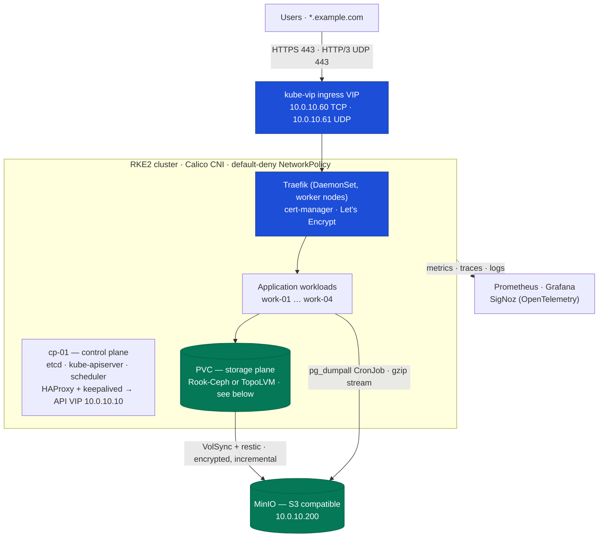
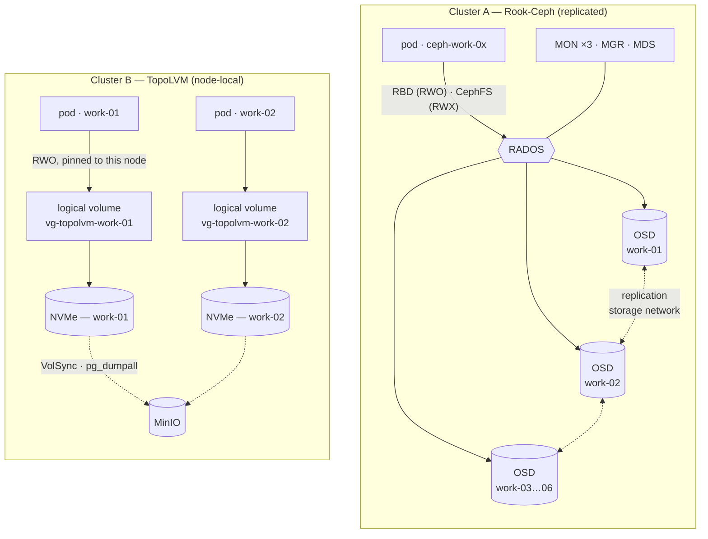

# bare-metal-kubernetes

Two on-premises **RKE2 Kubernetes** platforms built from bare metal — machine
provisioning, storage, networking, ingress, backup and observability — and the
engineering decisions behind them.

The centrepiece is a storage decision most on-prem clusters get wrong:
**when to run Rook-Ceph, and when node-local TopoLVM is the better engineering
choice.** Both are documented here, because I run both.

> **About this repository.** This is a reference implementation distilled from
> clusters I designed and operate. It is not a copy of them: hostnames, IP
> ranges, domains and cluster names are placeholders (`10.0.0.0/16`,
> `example.com`, `cp-01`, `work-01`), and the job of every value is explained so
> you can substitute your own. No credentials appear anywhere — by construction,
> not by redaction.

---

## The platform in one diagram



---

## Two clusters, two storage models

The control plane, edge and observability design above is shared. The storage
plane is where they diverge:



In Cluster A a write crosses the network and is replicated before it is
acknowledged, and any node can serve a volume. In Cluster B a write goes
straight to the local device and never leaves the node — so the redundancy
Ceph provides in-cluster is bought back with scheduled off-node backups.

| | **Cluster A** — replicated storage | **Cluster B** — node-local storage |
|---|---|---|
| Storage | **Rook-Ceph** (RBD + CephFS) | **TopoLVM** (thick LVM on NVMe) |
| Topology | 1 control plane + 6 workers | 1 control plane + 5 workers |
| Access modes | RWO **and RWX** | RWO only, node-pinned |
| Snapshots | Yes (RBD) | No (thick LVM) |
| Redundancy | Synchronous replication across nodes | None in-cluster — async copies + dumps |
| I/O path | Client → network → OSD/RADOS | Straight to the local NVMe device |
| Ops surface | MONs, MGRs, OSDs, CRUSH, PGs | An LVM volume group and a CSI driver |
| Fits when | ≥10 GbE (ideally a separate cluster network), enterprise NVMe, ≥5 nodes with CPU/RAM to spare | Modest networking, mixed drives, or where latency matters more than in-cluster redundancy |

**The short rule:** Ceph buys you replication, RWX and snapshots, and charges
network round-trips and operational complexity for them. TopoLVM gives raw device
latency and a trivial operational surface, and charges you the redundancy — which
you then buy back with scheduled off-node backups.

Full reasoning, with the decision matrix: **[docs/03-storage-decision.md](docs/03-storage-decision.md)**

---

## Documentation

| Doc | What's in it |
|---|---|
| [01 — Architecture](docs/01-architecture.md) | Topology, request flow, storage flow, network and CIDR plan, firewall ports |
| [02 — How I built it](docs/02-how-i-built-it.md) | Build order end to end: OS prep, API VIP, RKE2 server, joining workers, storage, edge |
| [03 — Storage decision](docs/03-storage-decision.md) | Rook-Ceph vs TopoLVM: the matrix, thick vs thin LVM, what each model costs |
| [04 — Ingress migration](docs/04-ingress-migration.md) | Reverse proxy → Traefik + kube-vip + cert-manager, with cutover and rollback |
| [05 — Backup and DR](docs/05-backup-and-dr.md) | Databases get dumps, files get VolSync — both to MinIO, with restore procedures |
| [06 — Observability](docs/06-observability.md) | Prometheus, Grafana, SigNoz tracing, and a purpose-built cluster health service |
| [07 — Security](docs/07-security.md) | Default-deny NetworkPolicy, RBAC, TLS, and how access is scoped |
| [08 — Lessons learned](docs/08-lessons-learned.md) | Real incidents: what broke, why, and the fix |

## Examples

Short, sanitized manifests — the shape of each object, with the reasoning in comments.

```
examples/
  rke2/        server + agent config.yaml, HAProxy, keepalived
  storage/     TopoLVM Helm values, per-node StorageClasses
  network/     MetalLB pool + L2 advertisement
  ingress/     kube-vip, Traefik HelmChartConfig, cert-manager ClusterIssuers
  backup/      VolSync ReplicationSource, pg_dumpall CronJob
  security/    default-deny NetworkPolicy set
```

---

## Stack

**Kubernetes** RKE2 · Calico · Helm · Rancher<br>
**Storage** TopoLVM · LVM · Rook-Ceph · MinIO<br>
**Networking & edge** MetalLB · kube-vip · Traefik · cert-manager · HAProxy · keepalived<br>
**Backup & DR** VolSync · restic · `pg_dumpall`<br>
**Observability** Prometheus · Grafana · SigNoz · OpenTelemetry<br>
**Platform** Ubuntu · Proxmox · Python · Bash

## License

MIT — see [LICENSE](LICENSE).
