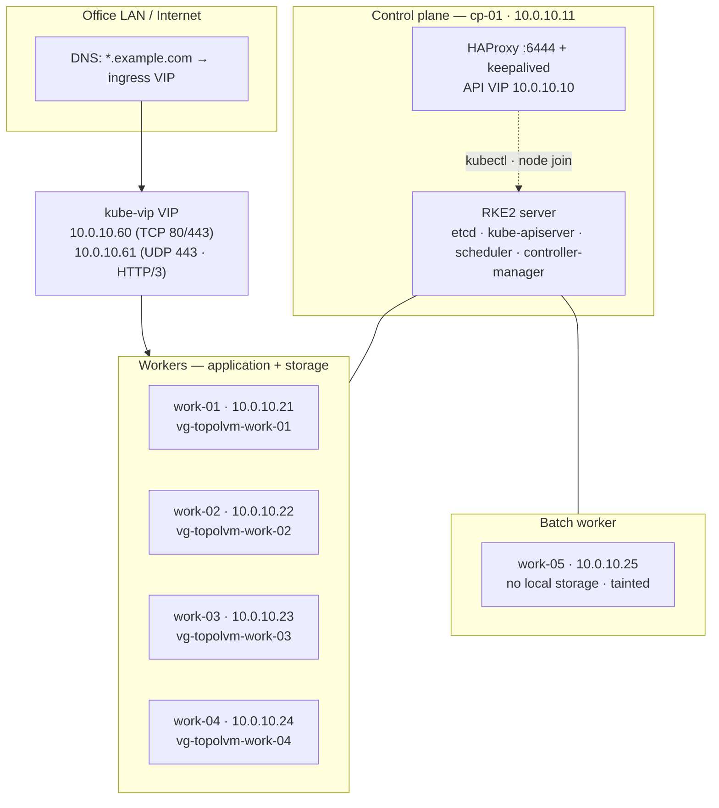
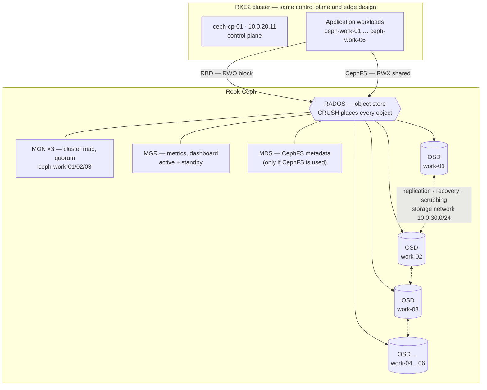

# 1 — Architecture

Topology, traffic paths and the address plan. Every identifier here is a
placeholder; the point is the shape, not the numbers.

---

## 1.1 Logical topology



**Roles.** `cp-01` runs the control plane and also schedules a light class of
workloads. Application pods are kept off it with `nodeSelector` rather than a
taint — a taint on the only control-plane node deadlocks RKE2's add-on bootstrap
([08 — Lessons learned](08-lessons-learned.md#1-a-taint-on-the-control-plane-deadlocked-the-cni-bootstrap)).
`work-05` carries no disk and keeps a `NoSchedule` taint, so only workloads that
explicitly tolerate it land there.

**Protecting the control plane.** Because `cp-01` is not tainted, the kubelet
holds CPU and memory back so pods can never starve etcd or the API server:

| Bucket | Protects |
|---|---|
| `system-reserved` | OS, sshd, containerd, kubelet |
| `kube-reserved` | Control-plane pods and kubelet headroom |
| `eviction-hard` | Evicts before the node is genuinely out of memory |

Control-plane pods run at `system-cluster-critical`, so under pressure the
scheduler preempts ordinary workloads to keep etcd alive. Workloads on `cp-01`
therefore keep the **default** priority class — never a system-critical one.

---

## 1.2 Request flow — external HTTPS

```
  user agent
     │  https://app.example.com
     ▼  DNS *.example.com → 10.0.10.60
     ▼  kube-vip announces the VIP by ARP from one worker
     ▼  Service (type=LoadBalancer, loadBalancerClass kube-vip.io/kube-vip-class)
     ▼  Traefik pod — TLS terminated with a Let's Encrypt certificate
     ▼  Ingress rule → ClusterIP service (svc.namespace.svc.cluster.local)
     ▼  application pod
```

`externalTrafficPolicy: Local` keeps the client IP intact — there is no proxy
hop in front of Traefik to carry an `X-Forwarded-For` header.

HTTP/3 rides a second VIP: the bundled Traefik chart does not add UDP/443 to the
main service, so QUIC is served by a separate UDP LoadBalancer on `10.0.10.61`,
with `http3.advertisedPort=443` so browsers see `Alt-Svc: h3=":443"` and keep
using the same hostname.

---

## 1.3 Storage flow — provisioning a PVC

```
  pod with PVC (storageClassName: local-ssd-work-01 — always explicit)
     ▼  volumeBindingMode: WaitForFirstConsumer — binding waits for scheduling
     ▼  allowedTopologies pins the volume to exactly one node
     ▼  topolvm-controller creates a LogicalVolume resource
     ▼  lvmd on that node carves a thick linear LV from vg-topolvm-work-01
     ▼  topolvm-node formats (xfs) and mounts it into the pod
     ▼  pod reads and writes at raw device speed — and is now pinned to that node
```

There is **no default StorageClass**. Every PVC names its class explicitly, or it
stays `Pending` — deliberate, so a volume never lands on the wrong node by
accident. Classes use `reclaimPolicy: Retain`, so deleting a PVC leaves the data
in place.

Capacity is tracked through the standard `CSIStorageCapacity` API, which lets the
stock scheduler place a pod only where its volume can actually fit. No scheduler
extender is involved — see
[08 — Lessons learned](08-lessons-learned.md#2-every-pod-with-a-pvc-was-unschedulable).

---

## 1.4 Network and address plan

Everything lives inside `10.0.0.0/16`, split so each function owns a clearly
separate range.

| Component | Value | Note |
|---|---|---|
| Node subnet | `10.0.10.0/24` | Static addresses, outside the DHCP scope |
| Control plane | `10.0.10.11` | `cp-01` |
| Workers | `10.0.10.21–.25` | `work-01` … `work-05` |
| API VIP | `10.0.10.10` | keepalived + HAProxy; the `kubectl` endpoint and a TLS SAN |
| Ingress VIP (TCP) | `10.0.10.60` | kube-vip → Traefik |
| Ingress VIP (UDP) | `10.0.10.61` | kube-vip → Traefik QUIC / HTTP-3 |
| MetalLB pool | `10.0.10.100–.150` | Other LoadBalancer services |
| Object storage | `10.0.10.200` | MinIO, S3 API on 9000 |
| Pod CIDR | `10.42.0.0/16` | No overlap with the LAN |
| Service CIDR | `10.43.0.0/16` | Cluster DNS `10.43.0.10` |

**Keep the VIP mechanisms apart.** keepalived owns the API VIP, kube-vip owns the
ingress VIPs, and MetalLB owns its own pool — three ranges that never intersect.
kube-vip is restricted with `lb_class_only` to a named `loadBalancerClass`, so it
claims only the ingress services and never competes with MetalLB for the rest.

### Firewall ports

| Port | Proto | Where | Purpose |
|---|---|---|---|
| 22 | TCP | all | SSH |
| 6443 | TCP | cp-01 | Kubernetes API |
| 6444 | TCP | cp-01 | HAProxy frontend for the API |
| 9345 | TCP | cp-01 | RKE2 supervisor (node join) |
| 2379–2380 | TCP | cp-01 | etcd client and peer |
| 10250 | TCP | all | kubelet |
| 80, 443 | TCP | workers | Ingress (TCP) |
| 443 | UDP | workers | Ingress (HTTP/3 QUIC) |
| 30000–32767 | TCP | all | NodePort range |
| 8472 | UDP | all | Calico VXLAN |
| 7946 | TCP+UDP | all | MetalLB speaker memberlist |

VolSync replication stays inside the cluster over ClusterIP, so it needs no
external ports.

---

## 1.5 Component stack

| Layer | Choice | Why |
|---|---|---|
| Distribution | RKE2 | Hardened defaults, bundled addons managed through `HelmChartConfig`, straightforward air-gapped installs |
| CNI | Calico | Mature NetworkPolicy enforcement, VXLAN across a plain L2 segment |
| API HA | HAProxy + keepalived | A stable API endpoint and room to add control-plane nodes without re-issuing kubeconfigs |
| LoadBalancer IPs | MetalLB (L2) | Real LAN IPs for services with no router or BGP configuration |
| Ingress VIP | kube-vip | A dedicated, class-scoped VIP for ingress that coexists with MetalLB |
| Ingress | Traefik (RKE2 bundled) | Stateless and horizontally scalable; configuration from the API, certificates in Secrets |
| Certificates | cert-manager | Automated Let's Encrypt issuance and renewal |
| Storage | TopoLVM / Rook-Ceph | See [03 — Storage decision](03-storage-decision.md) |
| Backup | VolSync + restic, `pg_dumpall` | Encrypted incremental file backups; consistent logical database dumps |
| Object store | MinIO | S3-compatible backup target that stays on-premises |

---

## 1.6 Cluster A — replicated storage topology

Everything above describes **Cluster B**, where storage is node-local. Cluster A
runs the same control-plane, edge and observability design, and differs in one
plane: storage is **replicated across nodes by Rook-Ceph**, which changes the
node roles, the network, and what a node failure means.



### What differs from Cluster B

| | Cluster A (Rook-Ceph) | Cluster B (TopoLVM) |
|---|---|---|
| Node subnet | `10.0.20.0/24` | `10.0.10.0/24` |
| Storage network | **Separate `10.0.30.0/24`** — replication traffic kept off the client path | None — I/O never leaves the node |
| Storage nodes | All six workers contribute OSDs | Four workers, each with its own volume group |
| A write | Client → primary OSD → replica OSDs → acknowledged | Straight to the local device |
| Node failure | Ceph re-replicates; volumes stay available elsewhere | That node's volumes are unreachable until it returns |
| Shared volumes | Across any node, via CephFS | Many pods, but all on the volume's node (RWO = one node) |
| Extra daemons | MONs, MGRs, OSDs, and MDS for CephFS | One `lvmd` per node |

**Why the separate storage network.** Every write costs a round-trip to each
replica, and recovery after a failed disk floods the same links. Putting
replication on its own network stops that traffic competing with application
traffic — this is the single most important piece of the "10 GbE or faster"
guidance in [03 — Storage decision](03-storage-decision.md).

**Why three MONs.** MONs hold the cluster map and need a quorum, so an odd
number ≥3 is required — with three, one can fail without losing quorum.

> **In depth:** [09 — Cluster A deep dive](09-cluster-a-ceph.md) follows this
> topology down to the mechanism: what each daemon owns, how a PVC becomes
> objects placed by CRUSH, pool and placement-group design, the two-chart
> install and its upgrade gating, and what failure and recovery actually look
> like.
