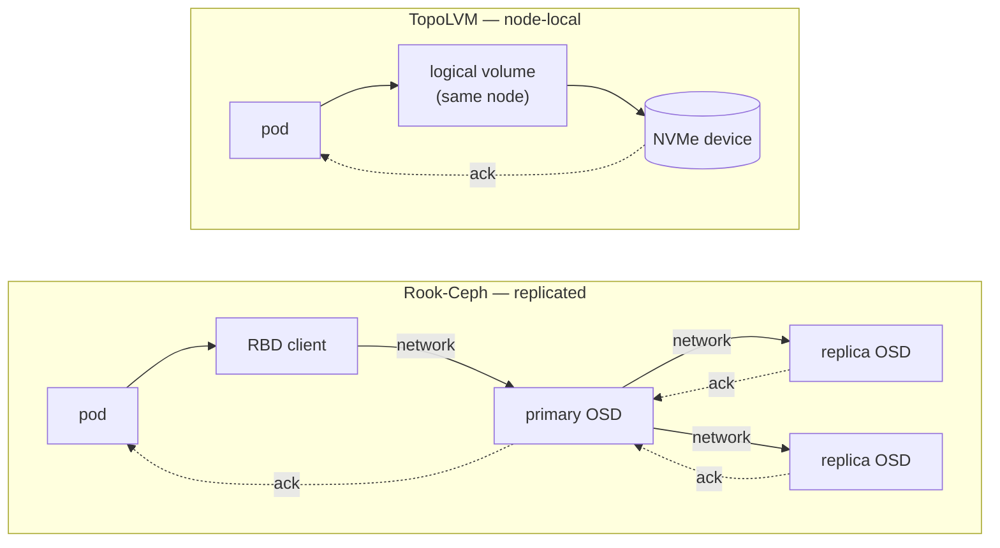

# 3 — Storage decision: Rook-Ceph or TopoLVM

The most consequential decision in an on-premises Kubernetes build. Both options
are good; they are good at different things, and the deciding factor is usually
the network rather than the disks.

I run both models, so this is a working comparison rather than a preference.

---

## 3.1 The rule

> **Rook-Ceph** when the cluster has **10 GbE or faster networking** — ideally a
> dedicated storage network — **enterprise NVMe** with power-loss protection, and
> at least five nodes with CPU and memory to spare for storage daemons.
>
> **TopoLVM** when any of those is missing: slower or shared networking, mixed or
> consumer-grade drives, fewer nodes, or a workload where predictable low latency
> matters more than in-cluster replication.

Ceph's design assumes the network is effectively free. Every write becomes a
network round-trip to the primary OSD and then to each replica before the client
gets its acknowledgement. Give it 10 GbE and NVMe and that cost disappears into
the noise. Put it on a congested or slower link and the network becomes the
storage device — the disks stop being the limit.

TopoLVM inverts the trade. A PVC is a plain LVM logical volume on the node where
the pod runs, so I/O never leaves the machine and latency is whatever the device
does. The cost is that the data has exactly one copy, on one node.

---

## 3.2 The two I/O paths

The whole argument is visible in what a single write has to do.

**Ceph:** the write is acknowledged only after it has crossed the network to the
primary OSD and been replicated. You are buying redundancy, RWX and snapshots,
and paying for them in round-trips — which is why the network, not the disks,
usually decides whether Ceph performs well.

**TopoLVM:** the write reaches the device on the node the pod is already running
on. Nothing traverses the network, so latency is whatever the hardware does —
and there is exactly one copy of the data, which is why backup becomes
load-bearing ([05 — Backup and DR](05-backup-and-dr.md)).

---

## 3.3 The decision matrix

| Requirement | Rook-Ceph | TopoLVM |
|---|---|---|
| Network ≥10 GbE, ideally dedicated | **Required** | Not required |
| Enterprise NVMe (power-loss protection) | **Strongly recommended** | Recommended, not required |
| Node count | 5+ (3 MONs, spare capacity to rebalance) | Any (1 disk = 1 node's storage) |
| Spare CPU/RAM per node for storage daemons | **Required** (OSDs are hungry) | Negligible (an LVM driver) |
| Shared access — many pods, **many nodes**, one volume | **Yes** (CephFS) | No — one node only |
| Shared access — many pods on the **same node** | Yes | **Yes** — RWO means one *node*, so co-scheduled pods share the volume |
| CSI snapshots and clones | **Yes** (RBD) | No with thick LVM; yes with thin |
| Survives a node failure without restore | **Yes**, automatically | No — the volume is unreachable until the node returns |
| Volume expansion | Yes | Yes |
| Lowest, flattest write latency | No — network + RADOS on every I/O | **Yes** — straight to the device |
| Operational surface | MONs, MGRs, OSDs, CRUSH map, PG tuning, rebalancing | One volume group per node, plus a CSI driver |
| Recovery when it goes wrong | Deep Ceph knowledge needed | `lvs`, `vgs`, and ordinary filesystem tools |

**Read it this way:** if the top three rows are all true, run Ceph and enjoy
replication, RWX and snapshots. If any is false, TopoLVM will be faster, far
simpler to operate, and more predictable — provided you take the backup
obligation seriously, because nothing else is protecting that data.

---

## 3.4 What TopoLVM costs, and how to pay it

Node-local storage has four consequences worth stating plainly.

1. **RWO means one *node*, not one pod.** A volume binds to a single node, and
   the pods that use it are scheduled there. Several pods **can** mount it at the
   same time provided they are co-scheduled on that node — that is what
   `ReadWriteOnce` means in Kubernetes, and it is a genuinely useful property:
   a sidecar, an importer or a batch job can share a volume with the workload
   that owns it. Use `ReadWriteOncePod` when you deliberately want to forbid
   that. What is **not** available is shared read-write access from pods on
   *different* nodes — that needs CephFS, NFS, or an object store.
2. **A node outage makes its volumes unreachable.** The data is intact, not lost,
   but it is offline until the node returns. Stateful workloads need either an
   application-level replica on another node or a restore path measured against
   your RTO.
3. **Capacity is per node.** A 100 GiB volume only schedules where one node's
   volume group has 100 GiB free. `CSIStorageCapacity` keeps the scheduler
   honest; `vgextend` adds a drive when a node runs short.
4. **No snapshots with thick volumes**, so replication runs in VolSync's `Direct`
   mode rather than from a snapshot.

The payment is a disciplined backup policy — scheduled, off-node, tested. That is
what [05 — Backup and DR](05-backup-and-dr.md) is about: replication alone is not
a backup, and a backup you have never restored is only a hope.

---

## 3.5 Thick or thin LVM

Having chosen TopoLVM, there is a second decision.

| | **Thick** (what I run) | **Thin** |
|---|---|---|
| Allocation | Reserved up front, mapped to physical extents | Allocated on write from a shared pool |
| Latency | Lowest and flattest — no copy-on-write, no allocation spikes | Slightly higher and less predictable |
| CSI snapshots | No | Yes |
| Overprovisioning | No | Yes |
| What you must monitor | Free space in the volume group | Pool data **and** metadata usage |
| Failure mode when full | New PVCs stay `Pending`; running writes are unaffected | A full pool can take volumes **read-only or offline** |

Thick wins on predictability: there is one number to watch, and a full volume
group can never endanger data that is already written. Thin is the right call
when snapshots or overprovisioning genuinely matter — moving between them is a
device-class change in the Helm values, not a redesign.

---

## 3.6 Layout: one volume group and one StorageClass per node

Each node gets a volume group named after itself, and a StorageClass pinned to
that node:

| Node | Volume group | Device class | StorageClass |
|---|---|---|---|
| work-01 | `vg-topolvm-work-01` | `ssd` | `local-ssd-work-01` |
| work-02 | `vg-topolvm-work-02` | `ssd` | `local-ssd-work-02` |
| work-03 | `vg-topolvm-work-03` | `ssd` | `local-ssd-work-03` |
| work-04 | `vg-topolvm-work-04` | `ssd` | `local-ssd-work-04` |

Why name them per node rather than sharing one class:

- **The volume group name identifies itself on the host.** `vgs` on any node
  immediately shows which node's storage you are looking at.
- **Placement becomes explicit.** `allowedTopologies` ties each class to one
  node, so a workload can be deliberately placed — and a replica of it
  deliberately placed *elsewhere*.
- **The device class stays uniform.** All four use `ssd`; only the volume group
  beneath differs, so the classes read identically apart from their node.

Each node runs its own `lvmd`, aimed by the built-in `kubernetes.io/hostname`
label, looking only for its own volume group. Nodes without storage are simply
never labelled, so no storage components schedule there at all.

Working manifests: [`examples/storage/`](../examples/storage/).

> **In depth:** [09 — Cluster A deep dive](09-cluster-a-ceph.md) for Ceph's
> daemons, CRUSH placement, pool design and the operational surface you take on
> with it. [11 — Day-2 operations, Part 2](11-day-2-operations.md) for the
> thick-versus-thin write path and the two independent ways a thin pool fills —
> the second of which can take running volumes offline.
