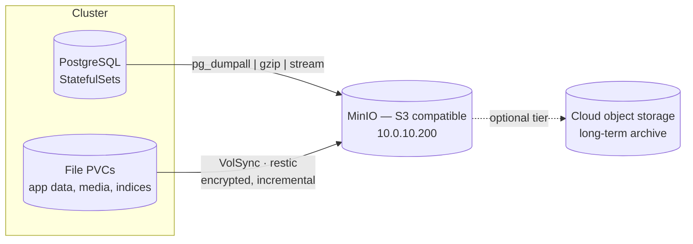

# 5 — Backup and disaster recovery

Node-local storage has one copy of the data. That makes backup the load-bearing
part of the design rather than an afterthought, and it has to be right.

---

## 5.1 The mental model

Everything lives on volumes, and thick LVM volumes cannot be snapshotted. So
nothing is "snapshotted" — data is **read out and shipped to object storage**.
Two kinds of data need two different methods:

| Data | Why it is different | Method | Tool |
|---|---|---|---|
| **Databases** | A file-level copy of a running database is inconsistent and may be unrestorable | A **logical dump** — a consistent export | `pg_dumpall` streamed to S3 by a CronJob |
| **File volumes** | Ordinary files, safe to copy while in use | **Encrypted, deduplicated, incremental** backups | VolSync + restic |

> **The rule: databases get dumps, files get VolSync.** Never trust a raw volume
> copy of a running database.



## 5.2 Layout in object storage

```
onprem-backup/
├── pgdump/<instance>/YYYY/MM/DD/<instance>-<timestamp>.sql.gz
└── restic/<namespace>/<pvc>/
```

- **`pgdump/`** — plain gzipped SQL, one object per run, partitioned by date, so
  restoring a specific day is a single `cp`.
- **`restic/`** — restic's own encrypted repository format, **one repository per
  volume**, which keeps deduplication, retention and restore independent per
  workload. Never read these by hand; restore through restic or VolSync.

## 5.3 Schedule and retention

Everything runs daily, outside business hours, on one schedule so a backup window
is a known quiet period rather than a moving target.

| Target | Type | Retention |
|---|---|---|
| PostgreSQL instances | `pg_dumpall` → object storage | Date-partitioned objects, pruned by lifecycle policy |
| Application file volumes | VolSync + restic | **7 daily · 4 weekly · 3 monthly** |

**Deliberately not backed up:** anything regenerable — metrics databases, caches,
message-broker spools, garbage-collection logs. Backing up a cache costs storage
and restores nothing of value. Write down what you excluded and why, or the next
engineer will assume it was an oversight.

**Recovery point objective:** a daily cycle means up to 24 hours of exposure.
That is a decision, not an accident — the workloads here tolerate it. Anything
needing a tighter RPO requires either more frequent syncs or streaming
replication, which is a different design.

## 5.4 How it is wired

1. **A CA ConfigMap** so restic trusts the object store's certificate.
2. **Secrets created out of band** — object-store credentials and one restic
   password per repository. These are never committed; the manifests reference
   them by name only.
3. **CronJobs** that stream `pg_dumpall | gzip` straight to object storage. No
   temporary disk is used, so a large database never fills the node it runs on.
4. **VolSync `ReplicationSource`s** in `Direct` mode — mandatory without
   snapshots — with a per-volume cache on the same node-local class as the source.

> ⚠️ **The restic password is the backup.** Lose it and the repository is
> unrecoverable — the data is encrypted and there is no recovery path. Store it
> in a password manager or secret store the moment you generate it, separately
> from the cluster it protects.

Manifests: [`examples/backup/`](../examples/backup/).

## 5.5 Running one now

```bash
# Database dump — a one-off Job from the CronJob
kubectl -n platform create job --from=cronjob/pgdump-primary pgdump-now

# File volume — trigger an immediate sync
kubectl -n platform patch replicationsource app-data-backup \
  --type merge -p '{"spec":{"trigger":{"manual":"run-'"$(date +%s)"'"}}}'
```

## 5.6 Checking health

```bash
kubectl -n platform get replicationsource    # LAST SYNC — must be recent
kubectl -n platform get cronjob              # LAST SCHEDULE
mc ls --recursive backup/onprem-backup/      # what actually landed
```

A backup job that silently stopped running looks exactly like one that has
nothing to do. **Alert on backup age**, not on job failure: the dangerous failure
is the job that never starts.

## 5.7 Restoring

**A database, from a dated dump**

```bash
mc cp backup/onprem-backup/pgdump/primary/2026/09/01/primary-<ts>.sql.gz .
gunzip primary-<ts>.sql.gz
psql -h primary-postgres -U postgres -f primary-<ts>.sql   # includes roles
```

**A file volume, from restic**

1. Scale the workload to zero, so the restore writes into a volume nobody is
   changing underneath it. Note that RWO binds the volume to one *node*: the
   mover pod has to run on that node, which is why the cache class must be one
   that can bind there.
2. Create a `ReplicationDestination` in `Direct` mode pointing at the same restic
   repository secret and the target volume, optionally with `restoreAsOf` for a
   point in time.
3. Wait for the sync to complete, then scale the workload back up.

## 5.8 What this does *not* protect against

Worth stating explicitly, because these gaps are where recovery plans fail:

- **VolSync replication is not a backup.** A copy made on a schedule will happily
  replicate a corruption or a deletion. Retention is what makes restic a backup —
  it keeps versions from before the mistake.
- **A node failure still means downtime.** Volumes are node-pinned; a restore is
  a restore, not a failover. Measure it against your RTO and rehearse it.
- **One site is one site.** On-premises object storage shares the building with
  the cluster. Tiering the important repositories to cloud object storage is what
  makes the backup survive the room.
- **An untested restore is not a backup.** Schedule real restores into a scratch
  namespace. The first time you try a restore should never be during an incident.

> **In depth:** [12 — Backup and disaster recovery](12-backup-deep-dive.md)
> covers the four backup patterns and when each applies, why a volume copy of a
> running database is unrestorable, how restic's per-volume repositories and
> content-defined chunking make deep retention nearly free, the options for
> tiering to cloud archive, and how restore testing is actually scheduled.
