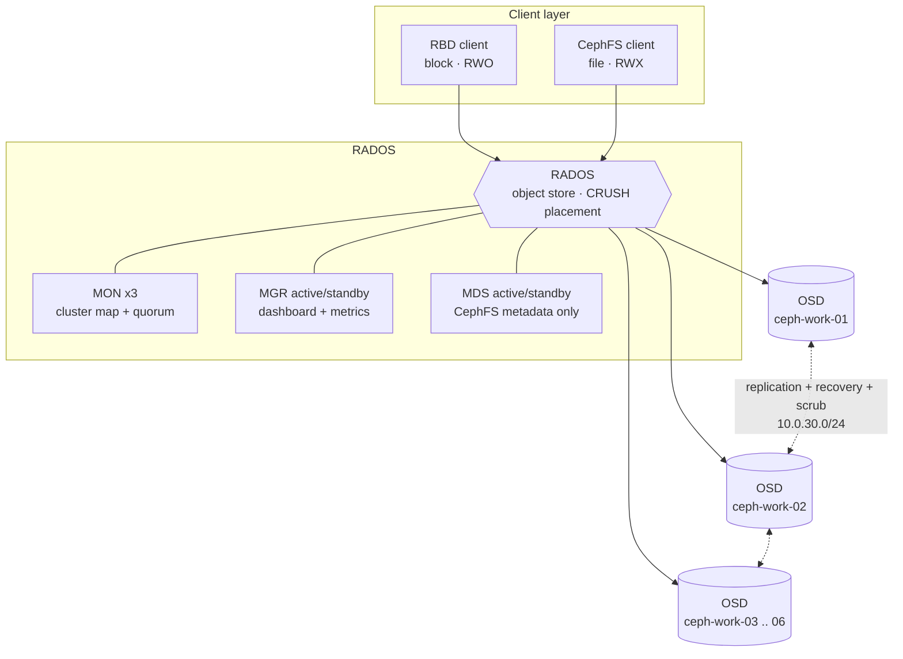
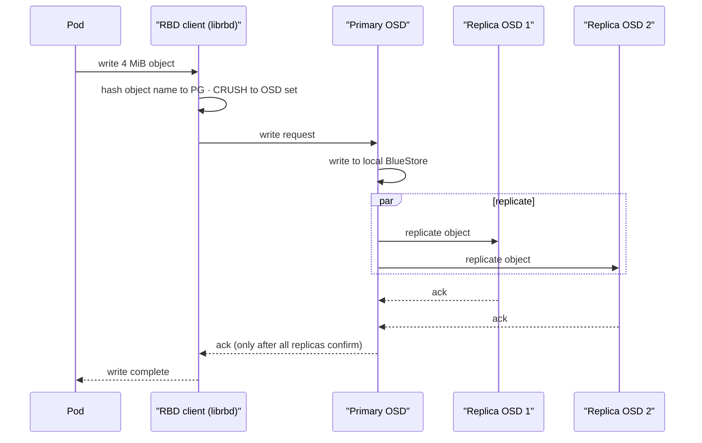
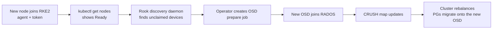
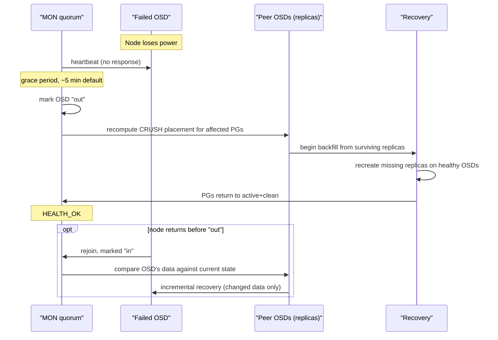

# 9 — Cluster A deep dive: Ceph internals and operations

[01 — Architecture](01-architecture.md#16-cluster-a--replicated-storage-topology) and
[03 — Storage decision](03-storage-decision.md) cover *when* to reach for
Rook-Ceph and what it costs against TopoLVM. This page stays inside that
decision and goes one layer deeper: what the daemons actually do, how a PVC
becomes bytes on a disk three times over, how the cluster is installed and
upgraded, and what running it day to day actually looks like — including the
configuration mistakes that are easy to make because Ceph will run quite
happily while carrying them.

Everything below is Cluster A: `ceph-cp-01` plus `ceph-work-01` … `ceph-work-06`,
node subnet `10.0.20.0/24`, storage/replication network `10.0.30.0/24`.

---

## 1. The daemons, and what each one owns

Ceph is not one process — it is five kinds of daemon that each own a narrow
slice of the problem, coordinated through **RADOS** (Reliable Autonomic
Distributed Object Store), the object store underneath every access method
Ceph exposes.

| Daemon | Owns | Count here | Notes |
|---|---|---|---|
| **MON** (monitor) | The cluster map: OSD map, MON map, PG map, CRUSH map. Quorum-based consensus on cluster state | 3 | Needs an **odd** number ≥ 3 so one can fail without losing quorum. MONs are cheap to run but expensive to lose — without quorum, nothing in the cluster can agree on where data lives |
| **MGR** (manager) | Metrics, the dashboard, the Prometheus exporter, the balancer module | 2 (active + standby) | Stateless relative to MON — losing the active MGR is a metrics gap, not a data-availability event |
| **OSD** (object storage daemon) | One OSD per disk. Stores objects, replicates them to peers, participates in recovery and scrubbing | One per storage device per worker | This is where capacity, IOPS and the replication network traffic all live |
| **MDS** (metadata server) | CephFS directory tree, permissions, file layout metadata | Only if CephFS is in use | Not involved in RBD or object-storage I/O at all — pure filesystem-semantics overhead |
| **RGW** (gateway, optional) | S3-compatible object API in front of RADOS | Not deployed in the base topology here | Included for completeness — some Ceph estates run this alongside RBD/CephFS on the same OSDs |



**Why the split matters operationally.** Each daemon fails differently. Losing
an OSD is routine — Ceph re-replicates and carries on. Losing MON quorum is not
routine — the cluster cannot make placement decisions at all until quorum
returns, even if every OSD is healthy. That asymmetry is why MONs get their own
placement rules (spread across hosts, never collocated by choice) and their own
priority class (`system-node-critical`), while individual OSDs are treated as
expendable, replaceable units.

---

## 2. From a PVC to bytes on disk

A write does not go to "a disk" — it goes through three deterministic
translation steps, none of which involve a lookup table.

```
PVC (RBD image, e.g. 100 GiB)
   |  librbd splits the image into fixed-size objects (4 MiB each)
   v
Object name, e.g. "rbd_data.1.0000000000000019"
   |  hashed
   v
Placement Group (PG) — a logical bucket of objects, e.g. PG 3.1a
   |  CRUSH maps the PG deterministically to a set of OSDs
   v
OSD set, e.g. [OSD.2 (primary), OSD.5, OSD.9]
   |  primary OSD replicates to the others, then acknowledges the client
   v
Bytes on each OSD's BlueStore backend
```

**CRUSH** (Controlled Replication Under Scalable Hashing) is what makes step 3
possible without a central directory: given a PG number, the cluster topology
(CRUSH map) and the pool's failure-domain rule, every MON and every client
computes the *same* OSD set independently. Nothing needs to ask "where is this
object" — everything can calculate it. That is also why re-weighting a node or
adding a device changes placement everywhere at once: the CRUSH map changed,
so the deterministic function that everyone runs now returns different
answers for the same inputs.

**The failure domain matters more than the number.** `failureDomain: host`
means CRUSH will never place two replicas of the same PG on OSDs that live on
the same node — a node failure can cost at most one copy. Set it to `osd`
instead (used deliberately for one pool here, see §8) and CRUSH stops caring
which node an OSD lives on, which is only safe if you have already accepted
that node's failure means that pool's failure too.

### The write path, replica-for-replica



This is the exact mechanism behind the "network round-trip" cost described in
[03 — Storage decision](03-storage-decision.md#32-the-two-io-paths): the client
does not hear "done" until every replica in the PG's OSD set has the data.
With `size: 3` that is two replication hops across `10.0.30.0/24` before the
application's write call returns.

---

## 3. Pool design: what actually gets replicated, and how

A **pool** is where the replication policy, the failure domain and the device
class are set — not per-PVC, but once, for every object that lands in it. This
cluster runs several pools, each tuned for what it holds:

| Pool | Backs | Failure domain | Replication | Device class |
|---|---|---|---|---|
| `ceph-blockpool` | RBD — general-purpose block volumes (RWO) | host | `size: 2` | nvme |
| `ceph-filesystem` (metadata) | CephFS directory tree | host | `size: 2` | nvme |
| `ceph-filesystem` (data) | CephFS file content (RWX) | host | `size: 2` | nvme |
| `ceph-objectstore` (metadata) | RGW bucket/object index | host | `size: 2` | nvme |
| `ceph-objectstore` (data) | RGW object bytes | host | **erasure coded 2+1** | nvme |
| `ceph-block-nvme` | A latency-sensitive RBD workload on one NVMe-equipped worker | **osd** | `size: 1` | ssd |

Two design choices are worth explaining rather than just tabulating:

**RBD and CephFS are replicated; the object store's data pool is erasure
coded.** Replication (`size: N`) stores N full copies — simple, fast to
recover, but N× the raw capacity. Erasure coding (`dataChunks: 2,
codingChunks: 1`, i.e. 2+1) splits an object into data chunks plus parity
chunks spread across OSDs, tolerating the loss of any one chunk for 1.5× raw
capacity instead of 2×–3×. The trade is CPU on every read/write and slower
recovery, which is why it is used here only for the object store's bulk data —
never for the metadata pool next to it, which stays replicated because losing
a directory index under load is a much worse day than losing a little
capacity efficiency.

**One pool deliberately breaks the "always replicate" rule.** `ceph-block-nvme`
runs `size: 1` with `failureDomain: osd` — a single copy, on a single OSD, on
a single node. This is not an oversight; it is a named, isolated pool carrying
an explicit comment in its own manifest:

> NVMe-only RBD pool — single OSD, replica 1. **WARNING**: `size=1` → no
> redundancy. Loss of that node's NVMe = total data loss for this pool.

That is the right way to take this trade-off if you must: contained in a pool
whose name says what it is, not applied cluster-wide. §8 covers the far riskier
version of the same idea — a **global default** quietly set to `size: 1`.

### The dangerous default versus the safe one

Two profiles for the same setting appeared in this environment at different
points, and the contrast is the single most instructive thing in the whole
config:

```yaml
# Profile A — optimised for throughput, not durability
[global]
osd_pool_default_size = 1
osd_pool_default_min_size = 1

# Profile B — hardened
# mon_allow_pool_delete = true
# osd_pool_default_size = 3
# osd_pool_default_min_size = 2
```

`osd_pool_default_size` is not "the size of one pool" — it is what **every
pool gets if nothing else specifies a size**. Profile A shipped as the live
default while the safer numbers sat next to it, commented out, as a reminder
rather than an enforcement. See §8 for why that ordering is the actual risk.

---

## 4. Capacity and PG sizing

**Placement Groups (PGs)** are the unit CRUSH actually places — not individual
objects (there are far too many of those) and not whole pools (too coarse to
balance well). The standard guidance is **100–200 PGs per OSD** for the whole
cluster; too few and data clumps unevenly across OSDs, too many and the
per-PG bookkeeping and peering overhead starts to bite.

```bash
# Read the current count
ceph osd pool get ceph-blockpool pg_num

# Ceph 5+ autoscales PGs by default (pg_autoscale_mode: on) — check status
ceph osd pool autoscale-status

# Manual override, if you need it
ceph osd pool set ceph-blockpool pg_num 128
ceph osd pool set ceph-blockpool pgp_num 128
```

**Capacity math is replication-factor math.** `ceph df` reports raw and usable
capacity separately, and the gap between them *is* the replication overhead:

| Replication | Usable per 1 TiB raw | What you're buying |
|---|---|---|
| `size: 1` | ~1 TiB | Nothing — one copy, one failure from data loss |
| `size: 2` | ~0.5 TiB | Survives one OSD failure; a second failure during recovery is not covered |
| `size: 3` | ~0.33 TiB | Survives one OSD failure with a spare copy still in reserve during recovery |
| EC 2+1 | ~0.67 TiB | Survives one chunk loss, at 1.5× overhead instead of 2×–3× |

A representative healthy cluster snapshot, read straight off `ceph pg stat`:

```
81 pgs: 81 active+clean; 196 GiB data, 586 GiB used, 1.4 TiB / 2.0 TiB avail
```

586 GiB used against 196 GiB of logical data is roughly 3×, i.e. this snapshot
was taken against `size: 3` pools — a useful sanity check to run any time
capacity planning looks off: divide `used` by the pool's replication factor and
compare it to what you expect the logical data volume to be.

**Keep headroom for rebalancing, not just for growth.** When an OSD or a node
fails, Ceph needs somewhere to *put* the re-replicated copies while recovery
runs — a cluster sitting at 85% full has nowhere for that data to go, and
recovery stalls or the cluster goes read-only exactly when you need it most.
Treat 80% as the real ceiling, not 95%.

---

## 5. Installing and upgrading: the two-chart pattern

Rook-Ceph ships as **two separate Helm charts**, installed in order, because
they manage two different lifecycles: the operator (a Kubernetes controller)
and the cluster it controls (a CephCluster custom resource).

```bash
# 1. Operator — installs the CRDs and the controller that watches them
helm repo add rook-release https://charts.rook.io/release
helm repo update
kubectl create namespace rook-ceph

helm install rook-ceph rook-release/rook-ceph \
  --namespace rook-ceph \
  --version v1.15.8 \
  -f values.yaml

kubectl -n rook-ceph wait --for=condition=Ready pod \
  -l app=rook-ceph-operator --timeout=300s

# 2. Cluster — the operator reconciles this into MONs, MGRs, OSDs, pools
helm install rook-ceph-cluster rook-release/rook-ceph-cluster \
  --namespace rook-ceph \
  --version v1.15.8 \
  --set operatorNamespace=rook-ceph \
  -f cluster-values.yaml

kubectl -n rook-ceph get pods -w    # MONs first, then OSD discovery, then MGR
kubectl -n rook-ceph get cephcluster
```

**Upgrading follows the same order** — operator first, cluster values second —
and is a `helm upgrade` against the same two releases with a new chart
version:

```bash
helm upgrade --namespace rook-ceph rook-ceph \
  rook-release/rook-ceph --version v1.19.5 -f values.yaml

helm upgrade --namespace rook-ceph rook-ceph-cluster \
  rook-release/rook-ceph-cluster --version v1.19.5 -f cluster-values.yaml
```

The operator then upgrades daemons **one at a time** — MONs, then MGRs, then
each OSD in turn — because it will not touch an OSD while doing so would drop
a PG below its `min_size`. That safety mechanism is controlled by a small
cluster of settings that are worth reading as a set, because they trade
upgrade speed against exactly that guarantee:

| Setting | Fast/permissive | Safe | What it actually gates |
|---|---|---|---|
| `skipUpgradeChecks` | `true` | `false` | Whether the operator checks PG health *at all* before upgrading a daemon |
| `continueUpgradeAfterChecksEvenIfNotHealthy` | `true` | `false` | Whether an unhealthy check blocks the upgrade or is only logged |
| `upgradeOSDRequiresHealthyPGs` | `false` | `true` (recommended for anything that matters) | Whether OSD upgrades wait for `active+clean` PGs before proceeding |
| `waitTimeoutForHealthyOSDInMinutes` | short | generous | How long the operator waits for an OSD to report "safe to stop" before moving on regardless |

Running the left-hand column is a deliberate choice for a lab where an upgrade
finishing fast matters more than an upgrade waiting for perfect health at every
step. Running it against production data is choosing to let an upgrade proceed
through pools that are not fully replicated — see §8.

**CRD note.** The operator chart manages the Rook CRDs (`crds.enabled: true`).
This is safe on first install and on every subsequent upgrade — but disabling
it later, or worse, letting the CRDs get deleted, is a real disaster-recovery
scenario, not a cosmetic setting. If it happens, Rook's own recovery procedure
for restoring CRDs after deletion is the only way back.

---

## 6. Day-2 operations

### Health checks

Almost everything starts from the toolbox pod, which is exactly what it sounds
like — a pod with the `ceph` CLI and admin credentials already wired in:

```bash
kubectl -n rook-ceph exec -it deploy/rook-ceph-tools -- bash

ceph status              # top-level: health, quorum, OSD count, PG summary
ceph health detail       # what, specifically, is not HEALTH_OK
ceph df                  # capacity per pool, raw vs usable
ceph osd status          # which OSDs are up/down, in/out, and their load
ceph osd tree            # the CRUSH hierarchy — which OSD lives where
ceph pg stat             # PG states — active+clean is the only fully healthy one
```

`HEALTH_OK` means every PG is `active+clean`. `HEALTH_WARN` covers a wide
range of "not wrong, not finished yet" states — OSDs still starting, a pool
below its target replica count during recovery, clock skew, a full-ish OSD.
`HEALTH_ERR` means something needs attention now — commonly a PG stuck
`inactive` because too many of its OSDs are down, or a pool below `min_size`
and refusing writes.

### The dashboard

The MGR dashboard is exposed the same way the rest of this platform exposes
internal UIs — through ingress — but Ceph terminates its own TLS, so the
ingress has to be told not to re-terminate it:

```yaml
apiVersion: networking.k8s.io/v1
kind: Ingress
metadata:
  name: rook-ceph-mgr-dashboard
  namespace: rook-ceph
  annotations:
    # The dashboard answers only in TLS, so Traefik must speak HTTPS to it
    # rather than the plain HTTP it would use by default.
    traefik.ingress.kubernetes.io/service.serversscheme: https
spec:
  ingressClassName: traefik
  tls:
    - hosts: ["ceph.example.com"]
      secretName: ceph-dashboard-tls
  rules:
    - host: ceph.example.com
      http:
        paths:
          - path: /
            pathType: Prefix
            backend:
              service:
                name: rook-ceph-mgr-dashboard
                port: { number: 8443 }
```

Two things are going on, and both are the same class of problem described in
[04 — Ingress migration §4.4](04-ingress-migration.md#44-things-that-bite-during-a-cutover):

- **Scheme.** Without `serversscheme: https`, Traefik sends plain HTTP to a
  port that only ever answers in TLS. The result is `wrong version number` and
  a 502 — a failure that reads like a broken backend rather than a protocol
  mismatch, which is what makes it slow to diagnose.
- **Certificate.** The dashboard presents its own self-signed certificate, so
  the proxy rejects it with `x509: certificate signed by unknown authority`
  until backend verification is relaxed. In Traefik that is the global
  `--serversTransport.insecureSkipVerify=true` already set in
  [`examples/ingress/traefik-helmchartconfig.yaml`](../examples/ingress/traefik-helmchartconfig.yaml)
  — a per-service transport alone is not honoured.

An ingress controller that supports TLS passthrough can instead hand the TLS
session straight through to Ceph untouched, which avoids both issues at the
cost of losing the edge's certificate management for that host.

### The balancer

Left alone, CRUSH's hashing is *even in expectation*, not even in practice —
some OSDs end up carrying more PGs than others just from how the hashes fall.
The `balancer` module actively moves PGs to flatten that out:

```bash
ceph balancer on
ceph balancer mode upmap   # the modern, precise placement mode
```

`upmap` mode issues small, targeted overrides on top of CRUSH's normal output
rather than reshuffling wholesale, so balancing runs as a low-level background
correction rather than a disruptive rebalance.

### Recovery throttling — the other side of §3's speed/safety trade

When an OSD needs re-replicating, how hard Ceph pushes on that recovery is
tunable, and the tuning is a direct trade against client-facing latency:

| Setting | Throughput-first | Client-latency-first |
|---|---|---|
| `osd_max_backfills` | 32 | 4 |
| `osd_recovery_max_active` | 50 | 8 |
| `osd_recovery_op_priority` | 10 (competes hard with client I/O) | lower, deprioritised |
| `osd_recovery_sleep` | `0` (no throttle) | a small delay injected between recovery ops |
| `osd_memory_target` | unset / default | explicit, e.g. `4294967296` (4 GiB) — keeps BlueStore's cache from starving the node |

Neither column is "correct" — the first gets back to `HEALTH_OK` fastest at
the cost of applications feeling every recovery, the second protects
foreground latency at the cost of a longer window running in a degraded
state. Pick deliberately, and pick per-environment: a lab recovering from a
deliberately-triggered failure test wants speed; a cluster serving live
traffic during an unplanned OSD loss usually wants the second column.

Scrubbing gets the same treatment for the same reason — it is a background
integrity check that also costs I/O:

```
osd_scrub_begin_hour = 22
osd_scrub_end_hour   = 6
osd_max_scrubs       = 1
```

Confining scrubs to a nightly window is a direct trade of "detect bit-rot
slightly slower" for "never compete with daytime application traffic."

### Draining a storage node for maintenance

An OSD node reboot without care is indistinguishable, from Ceph's point of
view, from an OSD failure — it starts recovering data it doesn't need to,
because the node is coming back in five minutes, not gone for good. Rook's
`disruptionManagement` block exists to tell it the difference:

```yaml
disruptionManagement:
  managePodBudgets: true      # Rook manages PodDisruptionBudgets for OSD/MON/MDS
  osdMaintenanceTimeout: 30   # minutes an entire failure domain stays "draining"
                               # before recovery kicks in anyway
```

With `managePodBudgets: true`, draining a storage node politely blocks until
Rook has confirmed it is safe — it will not evict an OSD pod if doing so would
take a PG below its `min_size`. `osdMaintenanceTimeout` is the ceiling on how
long the cluster will hold that grace period open before deciding the node
really is gone and starting recovery for real:

```bash
kubectl drain ceph-work-03 --ignore-daemonsets --delete-emptydir-data
# ... maintenance ...
kubectl uncordon ceph-work-03
```

### Adding an OSD node

Scaling out is deliberately unglamorous — join the node to Kubernetes, and
Ceph does the rest:



```bash
# On the new node
export RKE2_TOKEN="<token-from-ceph-cp-01>"
export RKE2_URL="https://10.0.20.11:9345"
curl -sfL https://get.rke2.io | INSTALL_RKE2_TYPE="agent" sh -
systemctl enable --now rke2-agent

# From anywhere with kubectl access
kubectl get nodes                                              # new node Ready
kubectl -n rook-ceph exec -it deploy/rook-ceph-tools -- ceph osd tree   # new OSD present
```

No pool definitions, no manual placement — CRUSH already knows how to use the
new OSD because the failure-domain rule is defined at the pool, not the node.
Removing a node is the mirror image: `kubectl drain`, let Rook mark the OSDs
`out` and wait for recovery to finish redistributing their data *before*
deleting anything, then `kubectl delete node`.

---

## 7. Failure and recovery, end to end



Two thresholds decide what "failure" actually means to the cluster, and both
come from §3's replication settings, not from anything OSD-specific:

- **While replicas ≥ `min_size`**, the PG stays read/write. A `size: 3,
  min_size: 2` pool tolerates one OSD down without any client-visible change
  beyond a HEALTH_WARN and background recovery traffic.
- **The moment replicas < `min_size`**, Ceph stops accepting writes to that PG
  rather than risk the last copy. This is a deliberate refusal, not a bug — a
  cluster that kept writing with one copy left would be one more failure away
  from data loss with no way back.

That second behaviour is exactly why `size: 1, min_size: 1` (§3's dangerous
default) is qualitatively different from `size: 2` or `size: 3`, not just
"less redundant": there is no floor left to protect. The very first failure
*is* the data-loss event, with nothing left for Ceph to refuse writes in
defence of.

**If the returning node comes back before the grace period elapses**, recovery
is incremental — Ceph diffs what changed rather than re-copying everything,
which is usually fast. **If it comes back after full recovery has already
rebuilt its data elsewhere**, it rejoins as a node with stale data and has to
catch back up, which costs more time but nothing riskier than that.

---

## 8. Operational gotchas actually seen running this

Five things worth carrying into any Ceph estate, in the [08 — Lessons
learned](08-lessons-learned.md) style: what happened, why, and the fix.

**1. A global default pool size of 1, with the fix commented out next to it.**
`osd_pool_default_size = 1` / `osd_pool_default_min_size = 1` sat in `[global]`
as the live setting, with `# osd_pool_default_size = 3` / `# min_size = 2`
directly below it, commented. The danger isn't the number — it's that a
default silently applies to **every pool created without an explicit size**,
including one created by a future `kubectl apply` nobody thought to check
against the config. **Fix:** treat `osd_pool_default_size`/`min_size` as
production gates checked at cluster-creation time, not values to tune later —
and if a non-default value is genuinely intentional for a specific pool, set
`size` explicitly on that pool's spec rather than leaving it to the global
default to happen to be right.

**2. A named single-replica pool is fine; an accidental one is not.**
`ceph-block-nvme` (§3) is `size: 1` on purpose, scoped to one pool, with a
warning comment in its own manifest. That is the *safe* shape of this
trade-off. The unsafe shape is the same number reached by leaving the global
default alone — same blast radius, but with no comment, no scoping, and no
one who chose it deliberately. **Lesson:** if you need `size: 1` anywhere,
make it loud and local, never ambient.

**3. Erasure-coded pools still need a replicated neighbour.** The object
store's EC 2+1 data pool sits next to a **replicated** metadata pool by
requirement — Rook will not let you erasure-code the metadata pool for a
filesystem or object store. Forgetting this and copying an EC spec wholesale
onto a metadata pool fails at apply time, not silently, but it costs a
diagnosis cycle the first time you hit it.

**4. The dashboard is an HTTPS backend, and the edge has to be told so.**
Because the MGR dashboard serves its own certificate, the ordinary ingress
pattern — terminate TLS at the edge, speak plain HTTP to the backend — simply
does not work: the backend never answers in HTTP. On Traefik the fix is
`traefik.ingress.kubernetes.io/service.serversscheme: https` on the Ingress,
plus relaxed backend verification for the self-signed certificate, which is a
**global** transport setting rather than a per-service one. An ingress
controller offering TLS passthrough can instead hand the session straight
through untouched. Whichever route you take, the failure mode when you get it
wrong is the same pair of errors documented in
[04 — Ingress migration §4.4](04-ingress-migration.md#44-things-that-bite-during-a-cutover):
`wrong version number` for a scheme mismatch, `x509: certificate signed by
unknown authority` for the certificate.

**5. "Fast" upgrade settings and "fast" recovery settings are the same
decision made twice.** `skipUpgradeChecks: true`, `continueUpgradeAfterChecks
EvenIfNotHealthy: true`, and `osd_max_backfills: 32` with `osd_recovery_sleep:
0` are three different knobs pointed at the same trade-off: get back to
"done" fast, and accept degraded redundancy for longer while you do it. None
of them is wrong in isolation — a lab rebuilding after a deliberate failure
test should run all three "fast" — but running them **on data you cannot
reproduce** is a choice that deserves to be made on purpose, not inherited
from a values file nobody re-read before go-live. The tell that it's time to
flip them: the moment the data in the cluster stops being disposable.

---

## Where this leaves Cluster A

None of the above changes the verdict in [03 — Storage
decision](03-storage-decision.md): Ceph is the right call when the network and
the drives can carry it, and the operational surface above — MONs, CRUSH, PG
tuning, replication trade-offs, upgrade gating — is exactly the surface you are
signing up to run in exchange for RWX, snapshots, and a node failure that costs
a HEALTH_WARN instead of an outage. The gotchas in §8 are not arguments against
Ceph; they are the specific ways its very large surface area for tuning can be
tuned wrong, quietly, by defaults that were never revisited after the cluster
stopped being a lab.
