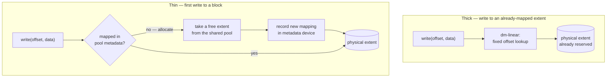
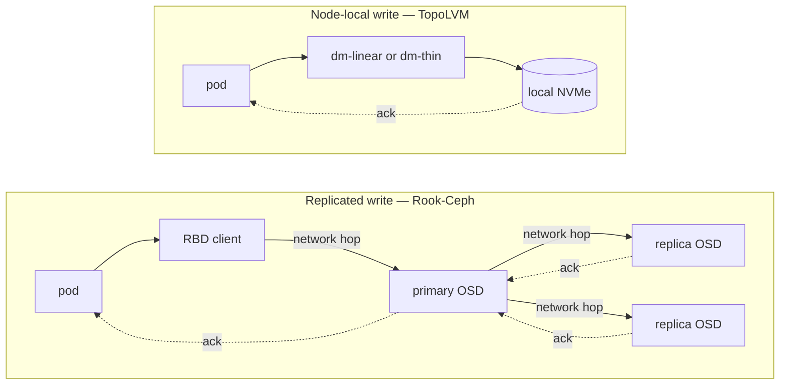

# 11 — Day-2 operations and storage performance

The build and decision docs cover getting a cluster up and choosing what to run
on it. This one covers the part that lasts longer: what to check routinely, how
to manage capacity, and how to change the cluster safely once it is carrying
real workloads. Part 2 then sets out the reasoning behind thick versus thin
LVM properly, rather than leaving it as the one-line recommendation it is in
[03 — Storage decision](03-storage-decision.md).

Both parts assume the topology already described in
[01 — Architecture](01-architecture.md): control plane `cp-01`, workers
`work-01`–`work-04` each with their own `vg-topolvm-work-0N` volume group and
`local-ssd-work-0N` StorageClass, a batch worker `work-05` with no local
storage, and — where Cluster A is discussed — the Rook-Ceph topology of
`ceph-cp-01` and `ceph-work-01`–`ceph-work-06`.

A note on access modes, because it comes up repeatedly below: a TopoLVM
volume is `ReadWriteOnce`, and in Kubernetes that means **one node**, not one
pod. Any number of pods can mount the same PVC at once, provided they are all
scheduled onto the node the volume is pinned to — a sidecar and its main
container, or several replicas that have been deliberately co-located, share
it without complaint. What RWO does not give you is access from a *second*
node at the same time; that is what CephFS's RWX is for. If a workload
genuinely needs to guarantee it is the only pod touching a volume — a
single-writer database, say — ask for that explicitly with
`ReadWriteOncePod`, which is enforced by the scheduler rather than assumed
from RWO.

---

## Part 1 — Day-2 operations guide

### 1.1 Routine health checks: what "healthy" looks like

Run this as a daily pass, or wire it into the health service described in
[06 — Observability](06-observability.md). Each row names the check and the
one-line answer that means "leave it alone."

| Area | Check | Healthy looks like |
|---|---|---|
| Nodes | `kubectl get nodes -o wide` | Every node `Ready`, no unexpected `SchedulingDisabled` |
| Pods | `kubectl get pods -A \| grep -vE 'Running\|Completed\|^NAMESPACE'` | Empty output |
| Events | `kubectl get events -A --sort-by=.lastTimestamp \| tail -30` | Nothing repeating; a `Warning` that occurred once during a deploy is not the same as one every five minutes |
| Storage classes | `kubectl get sc` | No default class present (deliberate — every PVC names its class) |
| Capacity tracking | `kubectl get csistoragecapacities -A -o wide` | Per-node free space reported and non-stale |
| Volume group free space | `ssh work-01 'sudo vgs vg-topolvm-work-01'` (repeat per node) | Comfortably above the alerting floor — see §1.2 |
| Certificates | `kubectl get certificate -A` | `READY=True` everywhere; nothing sitting `False` for more than a few minutes |
| Ingress | `kubectl -n kube-system get svc rke2-traefik -o wide` | `EXTERNAL-IP` is the ingress VIP, not `<pending>` |
| LoadBalancer services | `kubectl get svc -A \| grep LoadBalancer` | Every one has an `EXTERNAL-IP`, none `<pending>` |
| Backups | `kubectl -n platform get replicationsource,cronjob` | `LAST SYNC` / `LAST SCHEDULE` recent — alert on *age*, not on failure ([05 — Backup and DR §5.6](05-backup-and-dr.md#56-checking-health)) |
| etcd (control plane) | `kubectl get pods -n kube-system -l component=etcd`, `journalctl -u rke2-server \| grep -i etcd` | No leader-election churn, no `slow fdatasync` warnings |
| Cluster A only — Ceph | `kubectl -n rook-ceph exec deploy/rook-ceph-tools -- ceph status` | `health: HEALTH_OK` |

A five-minute version of this, worth scripting:

```bash
echo "Nodes:  $(kubectl get nodes --no-headers | grep -c Ready)/$(kubectl get nodes --no-headers | wc -l) Ready"
echo "Pods:   $(kubectl get pods -A --no-headers | grep -vc 'Running\|Completed') not settled"
echo "PVCs:   $(kubectl get pvc -A --no-headers | grep -vc Bound) not Bound"
echo "Certs:  $(kubectl get certificate -A --no-headers | grep -vc 'True') not Ready"
```

Anything nonzero on the last three lines is where you look next.

### 1.2 Capacity management for node-local LVM

Thick LVM gives you exactly one number to watch per node: free space in that
node's volume group. There is no pool metadata, no data/metadata split — the
whole capacity story is `vgs`.

**Monitoring free space**

```bash
# On the node
sudo vgs vg-topolvm-work-01
#   VG                #PV #LV #SN Attr   VSize   VFree
#   vg-topolvm-work-01   1   3   0 wz--n-  3.73t   1.10t

# From the cluster, per node, without SSH
kubectl get csistoragecapacities -A -o json \
  | jq -r '.items[] | select(.nodeTopology.matchLabels."kubernetes.io/hostname"=="work-01")
           | "\(.storageClassName): \(.capacity)"'
```

Scrape both into Prometheus (node-exporter's LVM collector, or a small
textfile-collector job that shells out to `vgs`) and alert on a threshold
that leaves room to react — 80% used is a reasonable first line, tightened
per node once you know its actual growth rate.

**Extending a volume group**

Two paths, depending on whether the node has a spare bay:

```bash
# A second physical device in the same node
sudo pvcreate /dev/nvme1n1
sudo vgextend vg-topolvm-work-01 /dev/nvme1n1
sudo vgs vg-topolvm-work-01                      # VFree grows immediately

# The existing device grew (rare on bare metal, common on a VM)
sudo pvresize /dev/nvme0n1
sudo vgs vg-topolvm-work-01
```

Extending a VG is online and non-disruptive — existing logical volumes are
untouched, and `CSIStorageCapacity` picks up the new free space on its next
sync (a few minutes; force it sooner by restarting the `topolvm-node` pod on
that host if you need the scheduler to see it immediately).

**What happens when a volume group fills**

This is the entire operational appeal of thick provisioning, stated plainly:

- **New PVCs on that node's class stay `Pending`.** The scheduler and
  `CSIStorageCapacity` agree there is nowhere to put them; that's a
  scheduling failure, not a data-safety incident.
- **Existing volumes and their running writes are completely unaffected.**
  A thick logical volume already has every extent it will ever have,
  allocated at creation time. There is no shared pool underneath it that a
  neighbour's growth can exhaust.
- **The fix is `vgextend`, or scheduling the next PVC on a different node's
  class.** Neither requires touching anything already running.

Contrast this with a full thin pool, which can take *running* volumes
offline — that comparison is the subject of Part 2.

### 1.3 Adding a new worker node

```bash
# 1. OS baseline — same steps as every other node (see 02 — How I built it §1)
#    swap off, kernel modules, sysctls, hostname lowercase RFC1123, time sync.

# 2. If it will carry storage: wipe and prepare its disk (02 — How I built it §2)
DEV=/dev/nvme0n1
lsblk -dno NAME,SIZE,MODEL "$DEV"
wipefs -a "$DEV" && sgdisk --zap-all "$DEV"
pvcreate "$DEV"
vgcreate vg-topolvm-work-06 "$DEV"

# 3. Join it — get the token from an existing control-plane node
ssh cp-01 'sudo cat /var/lib/rancher/rke2/server/node-token'

# on the new node
sudo mkdir -p /etc/rancher/rke2
cat <<'EOF' | sudo tee /etc/rancher/rke2/config.yaml
server: https://10.0.10.10:9345
token: <TOKEN_FROM_CP-01>
node-name: work-06
node-ip: 10.0.10.26
node-label:
  - "node.example.com/role=app"
EOF
curl -sfL https://get.rke2.io | sudo INSTALL_RKE2_TYPE="agent" sh -
sudo systemctl enable --now rke2-agent

# 4. Verify the join
kubectl get nodes -o wide                        # work-06 Ready
kubectl get nodes -L node.example.com/role

# 5. If it carries storage, label it and let TopoLVM pick it up
kubectl label node work-06 topolvm.io/storage=true --overwrite
kubectl get nodes -L topolvm.io/storage
# lvmd on work-06 activates automatically — it looks only for its own VG,
# named by kubernetes.io/hostname, so nothing else needs telling about it.

# 6. Give it its own StorageClass, matching the pattern of the existing ones
kubectl apply -f - <<'EOF'
apiVersion: storage.k8s.io/v1
kind: StorageClass
metadata:
  name: local-ssd-work-06
provisioner: topolvm.io
parameters:
  "topolvm.io/device-class": "ssd"
volumeBindingMode: WaitForFirstConsumer
allowedTopologies:
  - matchLabelExpressions:
      - key: topology.topolvm.io/node
        values: ["work-06"]
reclaimPolicy: Retain
EOF

# 7. Smoke-test before trusting it
kubectl create ns storage-smoke-test
kubectl apply -n storage-smoke-test -f - <<'EOF'
apiVersion: v1
kind: PersistentVolumeClaim
metadata:
  name: smoke
spec:
  storageClassName: local-ssd-work-06
  accessModes: ["ReadWriteOnce"]
  resources: { requests: { storage: 1Gi } }
EOF
kubectl -n storage-smoke-test get pvc,pod -o wide
kubectl delete ns storage-smoke-test
```

A node with no local disk (a batch or invoker-style node like `work-05`)
skips steps 2, 5 and 6 entirely — it is never labelled, so no storage
component ever schedules to it.

### 1.4 Draining and patching nodes safely

The mechanics are ordinary Kubernetes. The one thing worth internalising on
this platform is what draining does and does not do to node-local storage.

```bash
# 1. Cordon and drain
kubectl cordon work-02
kubectl drain work-02 --ignore-daemonsets --delete-emptydir-data --timeout=300s

# If a pod won't evict, find out why before forcing anything
kubectl get pods -A -o wide --field-selector spec.nodeName=work-02
kubectl get pdb -A                       # a PodDisruptionBudget may be blocking it

# 2. Patch / reboot
ssh work-02 'sudo apt update && sudo apt upgrade -y'
ssh work-02 'sudo reboot'

# 3. Wait for it to rejoin, then release it
kubectl wait --for=condition=Ready node/work-02 --timeout=180s
kubectl uncordon work-02

# 4. Confirm pods that belong there came back
kubectl get pods -A -o wide --field-selector spec.nodeName=work-02
ssh work-02 'sudo vgs vg-topolvm-work-02'      # VG survived the reboot untouched
```

**What draining does not do:** it evicts pods, it does not move their
volumes. Any pod whose PVC is pinned to `work-02` will not reschedule
anywhere else while it's drained — it simply sits `Pending` until `work-02`
comes back, because the data itself never left the node. That is expected
and fine for a routine patch-and-reboot, where the node returns in minutes.

It stops being fine if the plan is to *retire* the node permanently. Deleting
a node out from under its logical volumes does not delete the data (`Retain`
policy), but nothing will ever reach it again through Kubernetes. Before
decommissioning a storage node for good:

1. Replicate its volumes onto another node's class with VolSync (`Direct`
   mode — see [05 — Backup and DR](05-backup-and-dr.md)), or restore from the
   existing backup onto a new PVC elsewhere.
2. Re-point the workloads at the new PVCs and confirm they're healthy.
3. Only then drain, delete the node, and decommission the hardware.

### 1.5 Certificate renewal checks

cert-manager renews automatically, by default about 30 days before expiry,
and the day-2 job is mostly making sure that machinery is still turning over
rather than issuing certificates by hand.

```bash
# Everything, at a glance
kubectl get certificate -A
#   NAME             READY   SECRET           AGE
#   app-example-com  True    app-example-com  42d

# Days remaining, for anything you want to alert on directly
kubectl get certificate -A -o json | jq -r '
  .items[] | "\(.metadata.namespace)/\(.metadata.name): \(.status.notAfter)"'

# A certificate that flips from True to False after working for weeks —
# investigate the renewal path specifically, not the original issuance path
kubectl describe certificate <name> -n <namespace>
kubectl get certificaterequest,order,challenge -n <namespace>
kubectl -n cert-manager logs deploy/cert-manager --tail=100
```

Renewal fails for a narrower set of reasons than first issuance, because DNS
and the issuer account are already proven to work — the usual suspects are a
production rate limit hit by an unrelated burst of requests elsewhere in the
cluster, an HTTP-01 self-check that started failing because something
changed in the network path (a firewall rule, a NAT change), or an ACME
account that got invalidated. Alert on **days-to-expiry**, the same principle
as backup age in [05 — Backup and DR](05-backup-and-dr.md#56-checking-health):
a renewal that silently stopped working looks identical to one that has
nothing to do, until the certificate actually expires.

### 1.6 Upgrading RKE2 and the add-ons

Control plane first, then workers one at a time, never all at once:

```bash
# Control plane
ssh cp-01 'curl -sfL https://get.rke2.io | sudo INSTALL_RKE2_VERSION="v1.33.2+rke2r1" sh -'
ssh cp-01 'sudo systemctl restart rke2-server'
kubectl get nodes                                    # wait for cp-01 Ready again

# Each worker, one at a time — drain first (§1.4), then upgrade, then uncordon
kubectl drain work-01 --ignore-daemonsets --delete-emptydir-data
ssh work-01 'curl -sfL https://get.rke2.io | sudo INSTALL_RKE2_VERSION="v1.33.2+rke2r1" INSTALL_RKE2_TYPE="agent" sh -'
ssh work-01 'sudo systemctl restart rke2-agent'
kubectl wait --for=condition=Ready node/work-01 --timeout=180s
kubectl uncordon work-01
# repeat for work-02 .. work-05, never more than one at a time
```

One worker down at a time keeps every TopoLVM class but one available and
keeps enough Traefik/kube-vip replicas up that the edge doesn't blink.

**The add-ons are two different upgrade paths, and mixing them up is the
mistake to avoid:**

- **RKE2-bundled add-ons** (Traefik, CoreDNS, the CNI) are pinned to the RKE2
  version and upgrade *with* RKE2 — there is no separate Helm upgrade to run
  for them, and running one anyway fights the `HelmChartConfig` reconciler.
  Tuning stays in the `HelmChartConfig`, which survives the RKE2 upgrade
  untouched.
- **Independently installed charts** — TopoLVM, MetalLB, cert-manager,
  VolSync — upgrade on their own schedule with ordinary Helm:

```bash
helm repo update
helm upgrade topolvm topolvm/topolvm -n topolvm-system -f examples/storage/topolvm-values.yaml
helm upgrade cert-manager jetstack/cert-manager -n cert-manager --version v1.19.0
helm upgrade metallb metallb/metallb -n metallb-system
```

Check each chart's release notes for CRD changes before upgrading — a CSI
driver or cert-manager major version bump sometimes ships new CRDs that need
applying separately from the Helm release.

### 1.7 Rotating the node token

The node token gates **new** nodes joining the cluster; it is not what keeps
already-joined nodes authenticated day to day — those use client
certificates issued at join time, which RKE2 rotates automatically well
before they expire. That distinction is what makes rotation safe to do
without an outage:

```bash
# On the control-plane node
sudo cat /var/lib/rancher/rke2/server/token          # current token
sudo vi /etc/rancher/rke2/config.yaml                # set a new `token:` value
sudo systemctl restart rke2-server

# Existing nodes: unaffected. They authenticated once, at join time, and
# operate on certificates that don't depend on the token you just changed.

# Any node joining from now on needs the new token
sudo cat /var/lib/rancher/rke2/server/node-token     # updated value to distribute
```

Rotate it after a config file leak, when decommissioning access for someone
who had it, or on a routine schedule if your security policy calls for one.
It does **not**, by itself, remove an already-joined node's ability to
participate — do that with `kubectl delete node` and revoking that node's
certificate if you need to actively evict a compromised member.

### 1.8 etcd snapshot management

RKE2 takes etcd snapshots on its own by default (every 12 hours, five
retained) — day-2 work is mostly confirming that schedule is actually
running and taking a manual snapshot before anything risky.

```bash
# Confirm the automatic schedule is producing snapshots
ssh cp-01 'sudo rke2 etcd-snapshot list'

# Take one manually — always do this before an RKE2 upgrade, a re-addressing,
# or anything else that touches the control plane
ssh cp-01 'sudo rke2 etcd-snapshot save --name pre-upgrade-$(date +%Y%m%d)'

# Get snapshots off the node — a snapshot that lives only on the node it was
# taken from protects against nothing that also takes the node down
scp cp-01:/var/lib/rancher/rke2/server/db/snapshots/pre-upgrade-* ./
mc cp pre-upgrade-* backup/onprem-backup/etcd/

# Tune retention / cadence in the server config if the defaults don't fit
etcd-snapshot-schedule-cron: "0 */6 * * *"
etcd-snapshot-retention: 10
```

**Restoring** is control-plane-down maintenance — plan it as a deliberate
step, not a live operation:

```bash
sudo systemctl stop rke2-server
sudo rke2 server \
  --cluster-reset \
  --cluster-reset-restore-path=/var/lib/rancher/rke2/server/db/snapshots/pre-upgrade-20260901
sudo systemctl start rke2-server
kubectl get nodes                                   # workers rejoin on their own
```

Workers reconnect automatically once the control plane is back — their node
token and certificates are untouched by an etcd restore. This is also the
first step of the wider re-addressing runbook in
[08 — Lessons learned §5](08-lessons-learned.md#5-moving-a-cluster-to-a-new-network):
snapshot, change addresses, delete stale certificates, restore, rejoin.

### 1.9 Troubleshooting

Symptom to fix, in the order you'd actually hit each one:

| Symptom | Likely cause | Check | Fix |
|---|---|---|---|
| **Pods `Pending`** (general) | Insufficient CPU/memory on any matching node; `nodeSelector`/taint mismatch; no node satisfies affinity | `kubectl describe pod <pod>` (read the Events); `kubectl top nodes`; `kubectl describe node <node> \| grep -A3 Taints` | Free or add capacity; correct the `nodeSelector`/toleration; if it's storage-related, see the PVC row below |
| **PVC `Pending`** | `storageClassName` missing or misspelled (no default class exists); the target node's VG has no free space; the node isn't labelled `topolvm.io/storage=true`; `lvmd` on that node isn't ready | `kubectl describe pvc <pvc>`; `kubectl get sc`; `kubectl get csistoragecapacities -A -o wide`; `ssh <node> sudo vgs vg-topolvm-<node>` | Set the correct `storageClassName`; `vgextend` the VG or use a different node's class; label the node; check `kubectl -n topolvm-system get pod -o wide` for the missing `lvmd` |
| **Node `NotReady`** | `rke2-agent`/kubelet crashed or hung; network partition to the control plane; clock skew tripping etcd/TLS checks; disk pressure triggering eviction | `ssh <node> sudo journalctl -u rke2-agent -n100`; `ssh <node> systemctl status rke2-agent`; `ssh <node> timedatectl`; `ssh <node> df -h` | `systemctl restart rke2-agent`; fix the network path to the API VIP; resync the clock (`chronyd`); free disk space |
| **Certificate not issuing** | DNS record is private or missing (Let's Encrypt validates from the public internet); HTTP-01 self-check can't reach the public address (no hairpin NAT); rate limit hit; wrong `ClusterIssuer` referenced | `kubectl describe certificate <cert>`; `kubectl get certificaterequest,order,challenge -A`; `kubectl -n cert-manager logs deploy/cert-manager` | Add/fix the public A record; enable hairpin NAT at the firewall (or switch to DNS-01); retry with the staging issuer first; delete the stuck `Order` to force a retry once the cause is fixed |
| **LoadBalancer stuck `<pending>`** | MetalLB's pool is exhausted; `IPAddressPool`/`L2Advertisement` missing or misapplied; speaker pods not running; the service's `loadBalancerClass` is being claimed by kube-vip instead of MetalLB (or vice versa) | `kubectl -n metallb-system get ipaddresspool,l2advertisement`; `kubectl -n metallb-system get pods`; `kubectl -n metallb-system logs -l component=controller` | Expand the pool; (re)apply the missing custom resource; fix the speaker DaemonSet; confirm the service isn't scoped to the wrong `loadBalancerClass` |
| **Ingress returns 502** | Backend serves HTTPS but Traefik forwards to it as plain HTTP (or the reverse); the backend redirects HTTP→HTTPS and the proxy is stuck looping; the Service has no ready endpoints; a self-signed backend certificate is rejected | `kubectl describe ingress <name>`; `kubectl get endpoints <service> -n <ns>`; `curl` the ClusterIP directly from inside the cluster; check the Traefik pod logs for the specific error (`wrong version number` vs `x509: unknown authority`) | Match scheme and port to what the backend actually serves; for a self-signed backend, enable `insecureSkipVerify` on the entrypoint's transport (this is a **global** Traefik setting — a per-service transport alone is not honoured); fix the Service selector if there are no endpoints |

---

## Part 2 — Storage performance reasoning

### 2.1 What actually differs between thick and thin

Both sit on the same LVM stack and present the same block device to the same
CSI driver. The difference is entirely in how a logical volume gets its
extents.

**Thick** allocates every extent at creation time, mapped straight onto
physical extents (`dm-linear`). By the time the volume exists, its entire
capacity is already reserved and already has a fixed address on the device.
A write is a linear translation from logical to physical offset — nothing
to look up, nothing to allocate, nothing to copy.

**Thin** allocates nothing up front. A thin logical volume is a set of
mappings into a shared pool, and a block only gets a physical extent the
first time something writes to it (`dm-thin`). That first write is not a
plain write: it consults the pool's metadata device to see whether the block
is already mapped, allocates a new extent from the pool if not, records the
new mapping in the metadata device, and *then* writes the data. A read of an
unwritten block returns zeroes without ever touching the pool.

That difference is the whole story:



Every extra box in the thin path is a real cost paid on the write side:
a metadata lookup, sometimes a metadata write, sometimes a pool allocation —
none of which the thick path has to do, because thick already answered all
of those questions when the volume was created. That is why thick's latency
is both lower *and* flatter: there's no code path where a write can suddenly
take longer because this happens to be the first touch of that block.

### 2.2 The two failure modes of a thin pool

A thin pool has two capacity dials, and they fail differently — this is the
detail that most comparisons skip, and it's the one that matters most
operationally.

**Data exhaustion.** The pool runs out of free extents to allocate. New
writes to unmapped blocks fail (or, depending on configuration, the pool
pauses I/O until space is freed). This is bad, but it is the failure you'd
expect and it is scoped: it stops *new allocation*, and freeing space
(deleting a snapshot, extending the pool) resolves it without necessarily
losing anything.

**Metadata exhaustion is worse, and easy to underestimate.** The metadata
device is small relative to the data device by design — it only stores
mappings, not data — which means it's easy to size it without much thought
and forget it's a second, independent limit. When it fills, LVM's own
behaviour is to take the *entire pool* out of service — every thin volume
in it, not just the one that happened to trigger the exhaustion — because
the pool can no longer safely record new mappings for anyone. Depending on
version and configuration this shows up as the pool going read-only or the
volumes becoming inaccessible outright. Snapshots make this worse under the
hood: every snapshot adds more mappings to track, so a pool that's
comfortable on data usage can still be creeping up on metadata usage from
snapshot churn alone.

The asymmetry is the point: **thick has one number, and a full one only
blocks new allocation. Thin has two numbers, and a full one can take
existing volumes down with it.**

**Monitoring a thin pool**, if you run one:

```bash
lvs -a -o lv_name,data_percent,metadata_percent vg-topolvm-work-01
#   LV                 Data%  Meta%
#   thin-pool          62.30  71.10
#   [thin volumes...]

# Alert on BOTH — metadata filling faster than data is the early warning
# a data-percentage-only dashboard will miss entirely
```

**Monitoring a thick VG** stays the one-liner from §1.2 — `vgs`, one
percentage, no second dial to forget.

### 2.3 Why the network usually decides more than the disk

The comparison against replicated storage (Rook-Ceph) is a different axis
entirely, and it's worth being precise about what it actually costs, because
it is easy to state as "Ceph is slower" when the real claim is narrower than
that.



A replicated write is not acknowledged until it has crossed the network to
the primary OSD and been written by every replica — that's what "buying
redundancy" costs in the write path, on every single write, regardless of
how fast any individual disk is. Give that path fast, dedicated networking
and the round-trip disappears into the noise; put it on a slower or shared
link and the network becomes the bottleneck the disks are waiting behind.
Framed correctly, this isn't a statement about whether the drives or CPUs
involved were adequate — it's that replication and RWX are bought with a
network round-trip per write, and that trade is worth making exactly when
the workload needs what it buys (redundancy, multi-node shared access,
snapshots) and not otherwise. TopoLVM's node-local write has no such
round-trip to pay for, at the cost of the volume existing on exactly one
node — a different trade, not a free one.

### 2.4 How to decide

Work it as three questions, in order:

1. **Does anything need true multi-node shared read-write access?** If yes,
   that's CephFS (or NFS, or an object store) for that workload specifically
   — TopoLVM cannot provide it, full stop. Most clusters have a handful of
   workloads like this and a much larger number that don't; it's fine to run
   both storage systems side by side and place each workload deliberately.
2. **For everything else, does the workload need CSI snapshots or
   overprovisioning?** If genuinely yes, use a thin device class and monitor
   both dials from §2.2 without exception. If the honest answer is "not
   really, but snapshots sound useful," that's thick with scheduled backups
   instead — [05 — Backup and DR](05-backup-and-dr.md) exists precisely
   because "no snapshots" needs a replacement plan, not because thick is
   incomplete without them.
3. **Does the workload care about tail latency, not just average
   latency?** Thick's flat, no-allocation write path means its p99 tracks
   its median far more closely than either thin (occasional allocation
   cost) or replicated storage (occasional slow replica) can promise. For
   latency-sensitive workloads — anything synchronous on the request path —
   that flatness is usually worth more than the features it gives up.

None of this is a one-way door. Moving a node's device class from thick to
thin is a Helm values change and a new StorageClass, not a redesign — keep
that fact in mind rather than trying to predict every future workload's
needs on day one.
