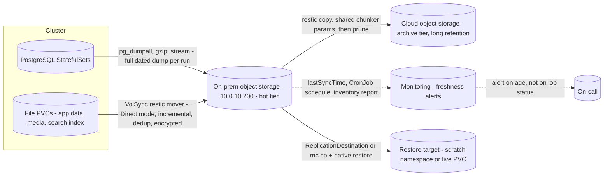

# 12 — Backup and disaster recovery, in depth

[05 — Backup and DR](05-backup-and-dr.md) gives the mental model — dumps for
databases, VolSync and restic for files — the object-storage layout and the
daily schedule. This page goes underneath it: why each pattern exists, the
maths behind the retention numbers, what tiering to cloud actually costs, and
how restore testing gets scheduled and proven rather than assumed.

## 12.1 Backup patterns, and when each applies

There is no single "backup" mechanism — there are several patterns, and
picking the wrong one for a given workload is the most common way a
restore fails. On storage with no CSI snapshot or clone support (the
thick, node-local case this repository documents for Cluster B), every
pattern below reduces to "read data out and ship it somewhere else" — the
question is only *what* reads it and *when*.

| Pattern | Mechanism | Use when | Why |
|---|---|---|---|
| **Direct volume copy** | VolSync `copyMethod: Direct` + restic mover reads the live, mounted volume | Ordinary files: uploads, static assets, config, search indices that tolerate a fuzzy point-in-time | Cheap, generic, works on any filesystem without app cooperation — but only *crash-consistent* |
| **Logical dump** | The application exports a self-consistent representation (`pg_dumpall`, `mysqldump`, a native export command) | Relational databases, anything with multi-file or multi-table invariants | The dump is consistent **by construction** — the exporting process, not the filesystem, guarantees it |
| **Native snapshot/export API** | The application's own backup tooling (Elasticsearch/OpenSearch snapshot API, a columnar store's `BACKUP` statement) | Databases with their own consistent, incremental, restorable format | Reinventing what the vendor already built correctly is wasted effort and a restore risk |
| **Quiesce + coordinated copy** | Scale the writer to zero (or pause it) immediately before a Direct volume sync, then resume | A database with no convenient logical-dump tool, where brief downtime is acceptable | Turns a crash-consistent copy into a clean one, at the cost of a short outage every cycle |

The decision is mechanical once you ask one question: **does this volume
hold a running database's own files?** If yes, a raw copy is disqualified
regardless of how the copy is taken — see 1.2. If no, Direct is normally
sufficient.

## 12.2 Why databases need logical dumps, not volume copies

A filesystem-level copy — whether it's `cp`, an rsync, or a restic mover
walking the tree — captures whatever bytes happen to be on disk at the
moment it reads each file. A running database defeats this in three
independent ways:

1. **Write-ahead logs and data files are copied at different instants.**
   Between the moment the copier reads the data file and the moment it
   reads the WAL segment a few seconds later, the database may have
   written more transactions. The copy now holds a data file and a log
   that don't agree.
2. **Multi-file invariants can be caught mid-update.** An index file and
   its table file, or a set of sharded segment files, can each be
   internally valid yet mutually inconsistent if the copier visits them
   at different points in an ongoing write.
3. **Buffered writes may not be on disk at all yet.** Data the engine
   considers committed can still be sitting in its own buffer pool,
   invisible to anything reading the files directly.

The result is not "sometimes corrupt" — it's **crash-consistent at best**,
meaning a restore is only as good as the database engine's own crash
recovery is at rolling forward or backward from an arbitrary point mid
write. Some engines recover cleanly from that; none of them do it
*reliably enough to be your disaster-recovery plan*.

A **logical dump** sidesteps the problem entirely: the dump tool talks to
the database's own transaction manager, so the export is consistent as of
one instant, by the same mechanism the engine already uses to give
read-committed or repeatable-read views to normal clients. That is why
the rule is unconditional — never trust a raw volume copy of a running
database — and why every database on this platform is either dumped
logically, exported through its own native snapshot API, or quiesced
around a volume copy as a deliberate, documented exception.

## 12.3 Restic repository design

**One repository per volume.** Each PVC gets its own restic repository
path under the bucket (`restic/<namespace>/<pvc>/`), rather than one
shared repository for the whole cluster. Three reasons:

- **Blast radius.** A corrupted or lost repository takes down the restore
  history for one volume, not every volume in the namespace.
- **Independent retention and prune.** Different data classes want
  different retention (§12.4); that's only expressible per repository.
- **restic allows exactly one writer per repository.** A shared repository
  would serialise every backup in the cluster behind one lock. A stale
  lock left by an interrupted mover — for example, a spec edited while a
  sync is in flight — blocks every subsequent run against that repository
  with a `WaitingForTrigger`/retry loop until someone runs `restic unlock`.
  Scoping one repository per volume means that failure mode affects one
  workload, not the whole estate.

**Content-defined chunking.** restic splits files into variable-length
chunks using a rolling hash, not fixed-size blocks. This matters because
it makes deduplication resilient to insertions: if a file grows by a few
bytes somewhere in the middle, a fixed-block chunker would shift every
subsequent block and destroy dedup for the rest of the file; a
content-defined chunker re-synchronises after the insertion and still
matches the unchanged chunks around it. Slowly-changing volumes — a media
library, an upload store — dedup extremely well under this scheme even
across months of daily backups.

**Encryption is client-side.** The mover encrypts every chunk before it
leaves the cluster, with a key derived from `RESTIC_PASSWORD`. The object
store (and anyone who compromises it) sees only encrypted, content-defined
blobs — never plaintext, never file names, never directory structure.

**Repository secret contents**, one per volume:

```yaml
apiVersion: v1
kind: Secret
metadata:
  name: restic-<volume>
  namespace: platform
type: Opaque
stringData:
  RESTIC_REPOSITORY: s3:https://10.0.10.200:9000/onprem-backup/<namespace>/<pvc>
  RESTIC_PASSWORD: <repository encryption passphrase>
  AWS_ACCESS_KEY_ID: <object-store access key>
  AWS_SECRET_ACCESS_KEY: <object-store secret key>
```

Trust for the object store's TLS certificate is supplied separately, as a
CA ConfigMap (`customCA`) mounted into the mover — that lets an internal,
self-signed endpoint be trusted properly instead of the alternative of
disabling certificate verification (see §14.4 for why that distinction
matters).

> **The restic password is the backup.** It never appears in the
> repository it protects — by design, that's what "encrypted" means. Store
> it in a password manager or secrets manager the moment it is generated,
> separately from the cluster, and treat losing it as equivalent to
> deleting every snapshot in that repository.

## 12.4 Retention maths

Retention is expressed as a policy over *snapshots kept*, not *days of
raw storage*, and the difference matters for both what you can restore
and what it costs.

**What a 7 daily / 4 weekly / 3 monthly policy actually gives you:**

| Retained tier | Count | Covers | Granularity |
|---|---|---|---|
| Daily | 7 | Last 7 days | Any day |
| Weekly | 4 | Roughly the next 4 weeks back | One point per week |
| Monthly | 3 | Roughly the next 3 months back | One point per month |

At most **14 snapshots** exist at any time (not 7 × 4 × 3), and the oldest
recoverable point is roughly 90 days back — but resolution coarsens the
further back you go: perfect day-granularity for last week, weekly
granularity for the month after that, monthly beyond. That trade-off — an
engineering decision, not restic's — is what makes retention cheap: you
are not keeping 90 daily copies to reach 90 days of coverage.

**Why storage cost does not scale with snapshot count.** Because restic
deduplicates at the chunk level (§12.3), the *marginal* storage cost of
keeping an extra snapshot is roughly the size of what changed since the
previous one, not the full volume size. A concrete illustration from a
slowly-changing, mostly-append media volume:

- Logical data on the volume: **~281 GB**
- Naïve (non-deduplicated) cost of keeping 14 daily/weekly/monthly copies:
  **14 × 281 GB ≈ 3.9 TB**
- Actual restic repository size, all 14 retained snapshots combined:
  **~63 GB**

That is roughly a **4.5× reduction** — not because any single snapshot is
smaller than the source data, but because thirteen of the fourteen
retained snapshots consist almost entirely of chunks the first one
already stored. This is the concrete payoff of deduplication: retention
depth becomes nearly free for data that doesn't change much, which is
exactly the case where you'd otherwise be tempted to keep *less* history
to save space.

The corollary: a volume with a **high daily churn rate** (most of its
bytes rewritten every day) will not dedup this well, and its retention
policy should be sized with that in mind — either shorter retention, or
an explicit acceptance of a larger repository.

## 12.5 What deduplication and encryption actually give you

Putting §12.3 and §12.4 together:

- **Deduplication** is what makes *frequent* backups of *large, slowly
  changing* volumes affordable — you pay once for the bulk of the data and
  only for the deltas thereafter. It is a cost property, not a safety
  property.
- **Encryption** is what makes it safe to hold that deduplicated data in
  storage you don't fully control — an on-premises object store shares a
  building, a network, and an operations team with everything else. The
  object store operator, and anyone who compromises it, gets encrypted
  chunks with no directory structure or file names.
- **Neither one is a retention or immutability control.** Both apply
  equally to a repository that only has one snapshot and one that has
  fourteen. Retention (§12.4) and, optionally, object lock/versioning at
  the storage layer are what protect old versions from being overwritten
  by a new, corrupted one — see §12.8's note on VolSync replication not
  being a backup on its own.

## 12.6 Tiering to cloud for long-term archive

**Why you cannot just move old objects out of the bucket.** A restic
repository is one coherent set of pack, index and snapshot files, and
deduplication means an old pack can still hold chunks that today's
snapshot references. Relocating "everything older than N days" to another
backend splits one logical repository across two stores and breaks
restores from both halves. "Keep recent data close, archive the rest" has
to be expressed as a **retention policy on snapshots**, not an
**object-age rule on the bucket**.

Three ways to do it, in order of how much control they give you:

| Pattern | How it works | Best when |
|---|---|---|
| **A — Two repositories, copy + prune** | The hot repository (on-premises) keeps a short retention (e.g. 3 days). A scheduled job copies new snapshots into a second, archive repository (cloud), seeded with the same chunker parameters so cross-repository dedup still works, then prunes the archive to its own long retention. Two fully independent, fully restorable repositories. | You want the on-premises store to stay small **and** a clean, independently restorable archive. **Recommended default.** |
| **B — Transparent storage tiering** | The object store itself transitions cold object *data* to a cloud remote tier while keeping the namespace and metadata local; restic still sees one repository, and the object store fetches tiered bytes on read. | You want one simple repository and are mainly optimising the cost of cold bytes. Restoring tiered data costs retrieval latency and, on public cloud, retrieval fees. Do not layer your own lifecycle/cold-storage rules on top of the tiered bucket — the object store owns that lifecycle once tiering is configured. |
| **C — Bucket replication / mirror** | One-way replicate the entire repository bucket to a second location; the source prunes locally, the mirror simply accumulates. | Minimal moving parts, a crude offsite copy — but you get one retention knob, and the mirror can drift from a clean restic retention model over time. |

Run the copy-and-prune job (Pattern A) close to the hot store rather than
inside the cluster, so the on-premises-to-cloud transfer happens once,
not once per PVC from inside the cluster's own uplink.

## 12.7 Monitoring backup freshness and staleness

**A backup job that silently stopped running looks exactly like a backup
job that has nothing new to do.** Both report "no error." This is the
single most dangerous failure mode in any backup design, because nothing
about it looks like a failure until the day you need the data.

The fix is to **alert on age, not on job status**:

```yaml
- alert: BackupStale
  expr: volsync_volume_out_of_sync == 1
  for: 1h
  labels: { severity: warning }

- alert: BackupMissedSchedule
  expr: time() - volsync_last_sync_timestamp_seconds > 86400
  for: 30m
  labels: { severity: critical }
```

The second rule is the important one: it fires purely on elapsed wall
clock time since the last successful sync, independent of whether
anything reported an error in between. Apply the same principle to the
dump CronJobs — alert if the newest dated object under a given prefix is
older than the schedule interval plus a margin, not merely if the last Job
object shows `Failed`.

Beyond alerting, keep a way to see the **whole backup estate on one
screen**: a small script or report that enumerates every restore point —
every repository's snapshot list, and every dated dump object — without
requiring an operator to authenticate against each secret individually.
A daily inventory written alongside the backups themselves (e.g.
`reports/YYYY/MM/DD/backup-inventory.txt`) gives a browsable record even
before you build real alerting.

## 12.8 Restore procedures and restore testing

**Restoring a single file volume**

1. Scale the workload to zero. TopoLVM-class volumes are RWO — nothing
   else can hold the volume while the restore writes into it.
2. Pre-create the destination PVC (same size or larger, correct storage
   class) if it doesn't already exist.
3. Create a `ReplicationDestination` in `Direct` mode pointing at the same
   repository secret and the target PVC, optionally with `restoreAsOf`
   for a specific date, or `previous: N` to go back N snapshots from that
   point.
4. Wait for the sync to complete, then scale the workload back up.
5. Delete the `ReplicationDestination` once verified — it is not meant to
   persist.

**Restoring a database from a dated dump**

1. Identify the dump by date from the object path
   (`pgdump/<instance>/YYYY/MM/DD/...`) or from an inventory report.
2. Download and decompress it.
3. Load it into the target instance with the corresponding native restore
   tool (`psql -f` for a plain-SQL dump; `pg_restore` for a custom-format
   dump). A `pg_dumpall`-style export includes roles, so a restore
   recreates the full instance, not just table data.

**Full-namespace disaster recovery**

1. Recreate the namespace and application manifests (from GitOps or
   version control).
2. Recreate Secrets — critically, the **same `RESTIC_PASSWORD`** used at
   backup time for each repository, plus database credentials. A restore
   with the wrong password is indistinguishable from a corrupted
   repository.
3. Per volume: pre-create the PVC → `ReplicationDestination` (Direct) →
   wait → verify.
4. Restore databases from their dated dumps or native snapshot tooling.
5. Scale workloads up in **dependency order** — database, then
   application, then ingress — not all at once.
6. Validate application health before declaring recovery complete.

Keep a short, per-namespace DR sheet ready before you need it: PVC names,
sizes and storage classes, repository paths, which services use dumps
versus volume backups, and the startup order. Writing it down in advance
is what turns step 5 from a guess into a checklist.

**Restore testing is not optional; it is part of the backup.** A backup
that has never been restored is a hypothesis, not a guarantee. Two
complementary drills, run on a schedule rather than "when someone
remembers":

- **Monthly:** restore one volume into a throwaway namespace, mount it,
  and spot-check or checksum the contents against what you expect.
- **Periodically, per repository:** run an integrity check —

  ```bash
  restic check                        # structural integrity of the repository
  restic check --read-data-subset=5%  # actually read and verify a sample of packs
  ```

`restic check` passing plus a successful test restore is the practical
meaning of the "0" in the 3-2-1-1-0 backup rule (3 copies, on 2 different
media, 1 offsite, 1 immutable/versioned, 0 errors on a verified restore) —
this architecture maps onto it as: the live volume, the on-premises hot
repository, the cloud archive, object lock/versioning as the immutable
copy, and a scheduled, verified restore as the proof.

## 12.9 RPO/RTO reasoning

Recovery point and recovery time objectives are decisions, not
after-the-fact measurements — they should be set deliberately per data
class, and the schedule should be chosen to satisfy them, not the other
way round.

| Data class | Backup frequency | RPO | RTO driver | Notes |
|---|---|---|---|---|
| Critical application config/state | Every 6 hours | ≤ 6 hours | Restore time is small (config-sized); mostly bound by manual steps | Tightest tier; still not zero — see below |
| Standard file volumes | Daily | ≤ 24 hours | Rehydration time is bound by link bandwidth and volume size | First full restore of a large volume can take hours; subsequent ones are unaffected by this since restore always pulls the full current snapshot |
| Logs / low-value data | Daily, shallow retention | ≤ 24 hours, low impact if missed | Rarely restored at all | Backing this up mainly protects against accidental deletion, not disaster |
| Database logical dumps | Daily (or more often for critical instances) | ≤ 24 hours, or the dump interval | Restore time scales with dump size and the target instance's load capacity | A full re-dump is taken every run — there is no "incremental dump" |

**A daily cycle means up to 24 hours of exposure, by design.** That's a
decision the workloads in this tier are expected to tolerate, not an
accident of the tooling. Anything that genuinely needs a tighter RPO
requires either more frequent syncs (with the operational cost of running
movers more often) or streaming replication — a fundamentally different
design (a standby that applies changes continuously, rather than a
backup that captures periodic snapshots). Don't try to buy a tight RPO by
shortening a snapshot schedule indefinitely; below a certain interval you
are fighting the tooling instead of using it.

**RTO is only a real number once it has been measured on a real restore.**
An estimate based on volume size and link speed is a starting point, not
the objective. The monthly restore drill (§12.8) is what converts "we
think a full-namespace restore takes about two hours" into a tested
number you can actually commit to.

## 12.10 What is deliberately not backed up, and why

| Category | Examples | Why it's excluded |
|---|---|---|
| Regenerable metrics/observability stores | Metrics database, dashboards | Rebuilds itself from the moment it restarts; historical gaps are cosmetic, not operational |
| In-memory / local caches | A cache layer sitting in front of a database | By definition disposable — the source of truth lives elsewhere; restoring a cache restores nothing that isn't already recoverable from that source |
| Garbage-collection / rotation logs | GC logs, rotated application logs | Diagnostic, not authoritative; their absence after a disaster affects forensics, not correctness |
| Message-broker spools/queues | In-flight queue data | **Only safe to exclude if you have verified** the producers can replay or the consumers tolerate loss — this needs an explicit, written justification, not just a decision to skip it |

The first three rows share a real justification: backing them up costs
storage and restores nothing of value, because the data is either
trivially regenerable or was never the authoritative copy. The fourth row
is different, and worth calling out precisely because it's easy to
get wrong: excluding a broker's data "because someone asked" is not the
same as excluding it "because we confirmed producers replay and no
message is uniquely lost." If you can't state *why* an exclusion is safe
in one sentence grounded in how the upstream system behaves, treat it as
an open risk, not a settled decision — and write the justification down
next to the exclusion so the next engineer doesn't have to reconstruct it
or, worse, assume it was simply an oversight.

## Backup data flow


