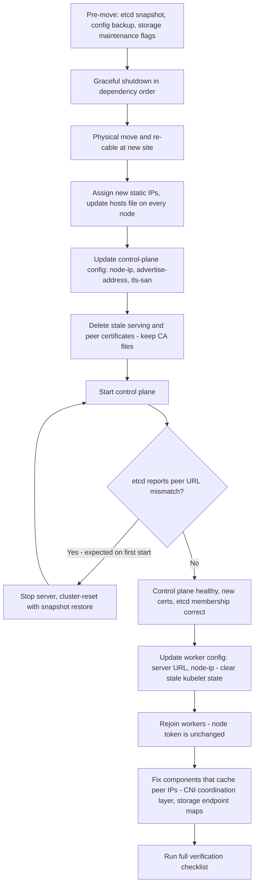

# 13 — Relocating a cluster to a new network

The reusable runbook behind the etcd peer-URL failure recorded in
[08 — Lessons learned §5](08-lessons-learned.md#5-moving-a-cluster-to-a-new-network).
Written as a general procedure rather than the log of one event, because a
cluster's addresses are part of its identity: they live in etcd's membership
list and in certificate SANs, and both refuse to start when they disagree with
reality.

This is the reusable procedure behind the etcd-peer-URL-mismatch incident
in "08 — Lessons learned." Written as a runbook rather than a log, so it
applies the next time *any* on-premises cluster needs to move buildings,
racks, or subnets.

## 13.1 The principle behind every step

A cluster's addresses are not incidental configuration — they are baked
into two places that actively refuse to start if they disagree with
reality:

- **etcd's membership list** records the peer URL each member advertises
  to the others. Change the address underneath a member and the other
  members — and the member itself, on restart — see a mismatch and stop,
  rather than silently reconnecting on the new address.
- **TLS certificate SANs** for the API server and etcd pin the valid
  addresses for those services. An address that isn't in the SAN list
  fails TLS validation, not just routing.

Treat a re-addressing as a **planned, rehearsed restore-from-snapshot**,
not as a network change the cluster will quietly absorb. Everything below
follows from that.

## 13.2 Pre-move checklist

1. **Confirm cluster health at the old location** — every node `Ready`,
   storage layer healthy, etcd healthy. Never start a move from a
   degraded state; you will not be able to tell which problems are new.
2. **Take a fresh etcd snapshot** and copy it off the node it was taken
   on, to storage that is travelling separately from the servers (or
   already off-site):

   ```bash
   rke2 etcd-snapshot save --name pre-migration-$(date +%Y%m%d)
   ```

3. **Back up every node's configuration** — the server/agent config file
   and `/etc/hosts` from each node — plus any storage-layer custom
   resources and their ConfigMaps/Secrets if the cluster runs a
   distributed storage layer.
4. **If the cluster runs distributed storage with rebalancing**, set its
   maintenance flags before touching anything, so a temporarily-degraded
   view of the cluster (nodes disappearing as they're powered off) doesn't
   trigger a rebalance or backfill that has nothing to rebalance toward:

   ```bash
   ceph osd set noout
   ceph osd set norebalance
   ceph osd set nobackfill
   ```

5. **Shut services down in dependency order**, not by pulling power:
   workers' agent service first, then the control-plane server service
   last. A graceful stop lets each component flush state; a hard power
   cut does not.
6. **Move the hardware.**

## 13.3 Re-addressing at the new location

1. Assign the new static addresses to every node.
2. Update `/etc/hosts` **identically on every node** — every node needs to
   resolve every other node's new address by the same hostname it used
   before:

   ```
   10.0.20.11   ceph-cp-01
   10.0.20.21   ceph-work-01
   10.0.20.22   ceph-work-02
   10.0.20.23   ceph-work-03
   10.0.20.24   ceph-work-04
   10.0.20.25   ceph-work-05
   10.0.20.26   ceph-work-06
   10.0.20.10   k8s-api.example.com
   ```

3. Verify basic connectivity — every node can reach every other node by
   hostname — **before** touching any Kubernetes or storage
   configuration. A networking problem discovered later looks exactly
   like a Kubernetes problem and wastes time in the wrong layer.

## 13.4 Control-plane recovery: certificates and etcd

1. Update the control-plane server configuration: the new addresses in
   `tls-san` (every hostname and IP the API server must be reachable on,
   including the load-balancer VIP), and, critically, **`node-ip`** and
   **`advertise-address`** set explicitly to the new address. This is
   what pins the server to the intended interface rather than letting it
   infer one.
2. Delete the **stale serving and peer certificates** — API server
   serving cert, kubelet serving key, etcd's serving/peer/client
   certs — while **keeping every CA file intact** (`server-ca.*`,
   `client-ca.*`, `etcd/server-ca.*`, `etcd/peer-ca.*`,
   `request-header-ca.*`). Deleting and letting the control plane
   regenerate from config on startup is simpler and less error-prone than
   trying to patch new SANs into an existing certificate.
3. Start the control-plane service. **Expect it to fail on the first
   attempt** with an etcd peer URL mismatch — this is expected, not a new
   problem:

   ```
   Failed to test etcd connection: this server is not a member of the etcd cluster.
   Found [<node-id>=https://<old-ip>:2380], expect: <node-id>=https://<new-ip>:2380
   ```

   etcd is running; it is correctly refusing to proceed because its
   stored membership still names the old address.
4. Stop the service and reset etcd cluster membership from the
   pre-migration snapshot:

   ```bash
   systemctl stop rke2-server

   rke2 server --cluster-reset \
     --cluster-reset-restore-path=<path-to-pre-migration-snapshot>
   ```

   This re-initialises etcd's membership using the *current* configuration
   — i.e. the new address — rather than attempting to patch the old peer
   URL in place. A direct `etcdctl member update` is a cleaner-looking
   fix on paper, but etcd generally won't accept it until it's already
   running, which is exactly the state you don't have.
5. Clear the reset flag and start normally:

   ```bash
   rm -f <data-dir>/reset-flag
   systemctl enable rke2-server
   systemctl start rke2-server
   ```

   On this start, the control plane should come up with etcd healthy,
   fresh TLS certificates carrying the new SANs, and the node reporting
   the new internal IP.
6. **Confirm the join token is unchanged.** The token lives outside etcd
   membership state, so a cluster-reset does not invalidate it — workers
   can rejoin with their existing credentials.

## 13.5 Rejoining workers

1. On each worker, update the agent configuration: the server URL now
   points at the control plane's new address, and `node-ip` is set to
   that worker's new address. The node name and token stay the same.
2. Clear stale local state before starting — cached kubeconfig and
   client certificates that reference the old control-plane address will
   not renegotiate on their own:

   ```bash
   rm -f <agent-dir>/kubelet.kubeconfig
   rm -f <agent-dir>/client-kubelet.crt
   rm -f <agent-dir>/client-kubelet.key
   ```

3. Start the agent service on each worker. All workers should report
   `Ready` with their new internal IPs once the CNI is functioning again
   (§13.6).

## 13.6 After-effects that show up only once the control plane is back

These are not part of the core etcd/cert procedure, but they are common
enough after any re-addressing to check for explicitly, because each one
looks like an unrelated failure if you don't know to expect it.

- **CNI mesh components that cache peer addresses.** A CNI that runs a
  central coordination service (for example, a Typha-style endpoint
  discovery layer) can have pods stuck not-ready with connection
  failures to *old* addresses, even though the Kubernetes `Endpoints`
  object nominally exists. The object itself can lag behind reality;
  deleting the coordination pods first (forcing endpoint recreation) and
  the per-node mesh pods second, in that order, resolves it. Restarting
  the per-node pods first, without addressing the stale coordination
  layer, will not fix anything — the same stale addresses get handed back
  out immediately.
- **Distributed storage endpoint maps that reference node IPs directly.**
  If the storage layer's own service discovery uses in-cluster Service
  IPs (which don't change across a re-addressing), only its *node
  mapping* metadata needs updating — typically a ConfigMap holding a
  hostname/IP table. Update it with the new addresses and restart the
  storage operator once pod networking is confirmed working; storage
  daemons that were stuck in an unknown state from before the move can
  usually just be deleted so the operator recreates them cleanly.
- **A control-plane administrative binary that isn't where the old
  documentation says.** Newer distribution releases sometimes stop
  shipping a standalone copy of a low-level admin CLI in the expected
  path — it still exists inside a container image layer, or is reachable
  by executing into the relevant pod. Don't assume "missing binary" means
  "broken install."

## 13.7 Post-migration validation checklist

- [ ] Every node `Ready`, reporting its new internal IP
- [ ] All system pods running (CNI namespace, storage namespace, ingress,
  monitoring)
- [ ] Storage layer reports healthy with no maintenance flags set
- [ ] All PersistentVolumeClaims `Bound`
- [ ] A PVC read/write smoke test passes
- [ ] Cluster DNS resolves correctly
- [ ] Cross-node pod-to-pod networking works
- [ ] The API load-balancer VIP responds on its port
- [ ] External DNS records for the API and any management UI point at
  the new VIP
- [ ] Application workloads healthy after a rolling restart

## 13.8 Key decisions, and why they were made this way

| Decision | Alternative considered | Why this way |
|---|---|---|
| In-place migration, preserving etcd and storage state | Rebuild the cluster from scratch at the new site | Preserves all data and avoids a separate data-migration project; justified when the state is large and the topology isn't changing |
| `--cluster-reset` with snapshot restore | Direct `etcdctl member update` of the peer URL | etcd generally has to be running to accept a member update, but it refuses to run while the mismatch exists — cluster-reset is the reliable way out of that deadlock |
| Delete stale certificates and let them regenerate | Patch new SANs into the existing certificates | Regeneration from config is simpler and less error-prone than hand-editing certificate contents, provided the CA files are preserved |
| Fix the CNI coordination layer before the per-node mesh pods | Restart per-node pods first | The per-node pods were symptomatic, not the root cause; restarting them first just re-fetches the same stale addresses |

## Migration sequence


