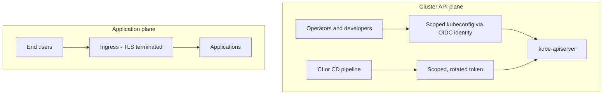

# 14 — Security, in depth

[07 — Security](07-security.md) states the principles: two access planes, a
default-deny network baseline, and least-privilege RBAC. This page supplies the
model underneath them — how a role is defined once and verified, where the
network rollout is harder than the five-policy baseline suggests, and the TLS
and secret-handling practices that keep the rest honest.

## 14.1 RBAC model

**Access is granted by role, not by person**, and the default for anyone
who isn't an operator is: deploy and debug inside your own namespaces,
read but never write secrets, and nothing cluster-scoped. The permission
set that implements this is deliberately narrow and worth stating
explicitly, because "developer access" left undefined tends to drift
toward "developer access = edit":

| Can | Cannot |
|---|---|
| Create, update and patch Deployments, StatefulSets, DaemonSets, Jobs/CronJobs, Services, Ingress, ConfigMaps, PVCs, HorizontalPodAutoscalers, PodDisruptionBudgets | **Delete** any of those — no workload teardown, no accidental PVC data loss |
| Manage Pods, including delete (restarting a pod under a controller just causes it to be recreated — the standard debug action) | Write Secrets, edit ServiceAccounts |
| Read logs, `exec`, `port-forward`, `kubectl debug` | Edit NetworkPolicies, ResourceQuotas, LimitRanges — read-only, so a developer can't weaken namespace isolation or quotas |
| Work inside their assigned application namespaces | Touch system namespaces, nodes, RBAC objects, CRDs, PersistentVolumes |

**Define the permission set once, as a `ClusterRole`,** and grant it
per namespace via `RoleBinding`s (a `ClusterRole` referenced by a
namespaced `RoleBinding` only applies within that namespace — it carries
no cluster-scoped power on its own). That single definition is the
canonical source of truth for "what a developer may do."

**Verify the role does what you intend, don't just trust the YAML:**

```bash
NS=platform
# should be yes:
kubectl auth can-i create deployments -n $NS --as=dev --as-group=developers
kubectl auth can-i get    pods/log    -n $NS --as=dev --as-group=developers
kubectl auth can-i create pods/exec   -n $NS --as=dev --as-group=developers
# should be no:
kubectl auth can-i create secrets            -n $NS --as=dev --as-group=developers
kubectl auth can-i delete networkpolicies    -n $NS --as=dev --as-group=developers
kubectl auth can-i get    nodes                     --as=dev --as-group=developers
kubectl auth can-i '*'    '*'                -n kube-system --as=dev --as-group=developers
```

`--as`/`--as-group` impersonation is the cheapest way to catch an RBAC
rule that grants more (or less) than you meant, before a real developer
finds out the hard way.

**Management-UI role mapping.** On a cluster fronted by a management UI
that authenticates users and issues their kubeconfigs itself (rather than
the API server consuming native `RoleBinding`s directly for those
sessions), the UI's own role model has to carry the **identical rule set**
as the canonical `ClusterRole` — the UI does not consult native
`RoleBinding`s for identities it issued itself. In practice this means
maintaining two objects that must never drift apart: the portable
`ClusterRole`, and the UI-specific role object that mirrors it. Treat any
edit to one as requiring the identical edit to the other, and say so
explicitly in both files' comments — this kind of drift is invisible until
someone notices a developer can do something the `ClusterRole` alone
would never have allowed.

Most such UIs also expose a way to **group namespaces** (a project, an
environment, a folder) so a role can be assigned once to the group rather
than once per namespace as membership changes. Use it, but exclude any
namespace that holds authentication or identity material from the
default developer grant — even a read-only Secret permission is often too
much exposure for that one namespace, and it should be a deliberate,
separately-reviewed decision to include it, not an accident of "it was in
the same project as everything else."

## 14.2 The two access planes, and a third identity class

Extending the split already established: **cluster API access** (for
operators and developers) and **application access over HTTPS** (for end
users) fail independently and never bridge — but a real deployment also
has a third identity class that needs its own treatment:

| Plane | Identity | Access mechanism | Rule |
|---|---|---|---|
| Cluster API | Human operators and developers | OIDC-backed identity, scoped `RoleBinding`/role-per-namespace | **Never** a long-lived ServiceAccount token for a human — humans authenticate via OIDC, full stop |
| Cluster API | CI/CD pipelines | A named, scoped, rotated token, bound to only the namespaces that pipeline deploys to | No interactive or standing human-style credential; if a token leaks, it should be traceable to one pipeline and revocable without touching anyone else's access |
| Application | End users | HTTPS through the ingress only | Never receives cluster credentials; a compromised application session cannot escalate to `kubectl` access |

Two operational habits make this split actually hold over time rather
than eroding:

- **Review bindings on a schedule (quarterly is reasonable), not just at
  creation.** Access that was correct when granted silently becomes wrong
  as people change teams or projects wind down; nothing forces a
  re-review unless you schedule one.
- **Audit logging on the API server, shipped to the monitoring stack,
  with alerts on RBAC changes and failed authentication.** The two events
  worth paging on are "someone's permissions just changed" and "someone
  is repeatedly failing to authenticate" — both are cheap to detect and
  expensive to discover after the fact.

## 14.3 NetworkPolicy rollout strategy

The five-policy default-deny baseline (deny-all, allow-DNS,
allow-same-namespace, allow-from-ingress, allow-to-API) is the right
*shape*, but rolling it out safely across an existing cluster is where
most of the actual difficulty lives:

1. **Pick one non-critical namespace first.** Apply the full five-policy
   set there, then watch for broken traffic before touching anything
   else. Every namespace has flows you didn't think to enumerate until
   something breaks.
2. **Verify each flow before you lock it down, not after.** For every
   namespace you're about to default-deny, list what it actually talks
   to today — which other namespaces, which system services, which
   external endpoints — and write an explicit allow rule for each one
   *before* applying the deny-all baseline. Applying deny-all first and
   fixing breakage reactively works, but it turns a planned rollout into
   an incident.
3. **Rely on the namespace's own auto-set label for namespace-scoped
   rules** (`kubernetes.io/metadata.name`) rather than hand-maintained
   labels — it's set by Kubernetes itself on every namespace, so a
   `namespaceSelector` built on it can't drift out of sync the way a
   custom label can.
4. **Carve out system namespaces explicitly, and don't default-deny them
   until each of their flows is tested separately.** CNI, storage, load
   balancer, ingress and monitoring namespaces have their own dense mesh
   of required traffic; treating them the same as an application
   namespace on day one is how a rollout takes down the platform instead
   of hardening one app.
5. **Tighten beyond the baseline once it's stable.** The baseline's
   `allow-same-namespace` and `allow-ingress-from-edge` rules typically
   use an empty `podSelector: {}`, meaning "any pod in this namespace."
   Once the namespace is stable under the baseline, narrowing those
   selectors to the specific pods that actually need the traffic (rather
   than every pod in the namespace) is the next hardening step, and it's
   much safer to do against a namespace that's already under
   default-deny than to try to do both at once.

## 14.4 TLS and secret-handling practices worth documenting

- **Prefer distributing an internal CA over disabling TLS verification.**
  Where an internal service (an on-premises object store, say) uses a
  self-signed certificate, the correct pattern is to mount that CA into
  every client that needs to trust it — a ConfigMap holding the CA
  certificate, referenced by name — so verification stays on. Some
  simple tools genuinely lack a way to supply a custom CA and only offer
  a blanket "skip verification" flag; when you have to use one, scope it
  as tightly as possible (one specific job, talking to one specific
  internal endpoint, never anything crossing a real trust boundary), and
  write down *why* it's an accepted exception rather than letting it look
  like the default.
- **Nothing sensitive is committed, ever — including the tooling that
  creates secrets.** Manifests reference Secrets by name; the Secrets
  themselves, and any script that creates them from raw credentials, are
  created out of band and kept out of version control entirely. A script
  that reads credentials from a local, git-ignored file and applies them
  as Secrets is fine; committing that file, or hard-coding the
  credentials into the script "just for now," is exactly the kind of
  exception that outlives its justification.
- **Backup encryption passwords and object-store credentials live
  outside the cluster they protect**, in a password manager or secrets
  manager, from the moment they're generated (§12.3). A password stored
  only inside the cluster it encrypts is not a backup password — it's a
  single point of failure with extra steps.
- **Distinguish the platform's own managed PKI from application-facing
  certificates.** A certificate-management controller issuing and
  renewing certificates into Secrets for applications is one trust model
  — renewal happens proactively, on a timer, well before expiry. A
  cluster distribution's own internal certificates (API server, etcd) are
  typically a separate, self-managed PKI: deleting the serving/peer
  certificates and restarting the control plane regenerates them from the
  current configuration, which is exactly the mechanism the migration
  runbook in [13 — Relocating a cluster](13-cluster-relocation.md) relies on.
  Know which model a given certificate
  belongs to before assuming "just delete it and it'll come back" applies.
- **Node access follows the same least-privilege logic as cluster
  access.** SSH by key only, restricted to the operations group, ideally
  through a bastion or VPN rather than direct exposure — no password
  authentication. A node compromise bypasses every Kubernetes-level
  control at once, so it deserves at least the same rigor as cluster API
  access.
- **A workload hardening baseline complements, but doesn't replace,
  network and RBAC controls.** Pod Security Admission set to a
  restricted profile on application namespaces, dropped Linux
  capabilities, `runAsNonRoot`, and read-only root filesystems where
  practical, all reduce what a compromised container can do even if the
  network and RBAC layers around it are sound — defence in depth, not a
  substitute for either.

## The two access planes



The two subgraphs above are deliberately drawn with no connecting edge:
that absence is the point. A person or pipeline with cluster API access
never gains it *through* an application, and an application user never
receives cluster credentials by virtue of reaching an application. Each
plane can fail — or be compromised — without the other being affected.
