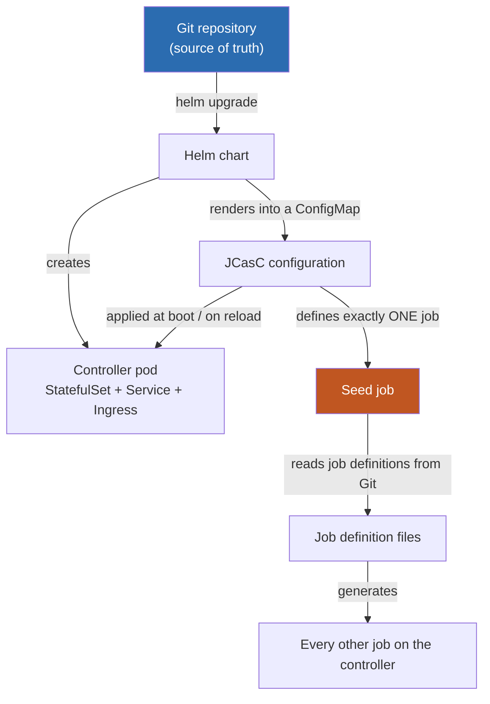
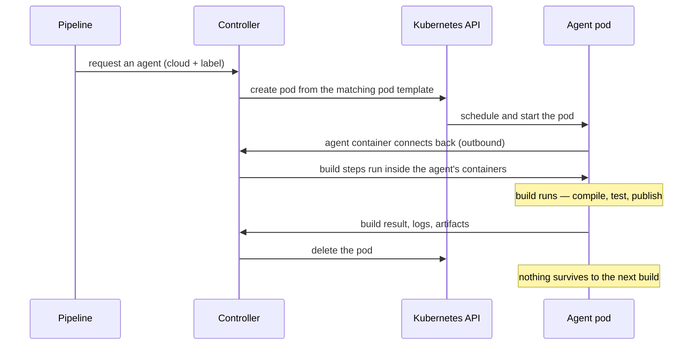
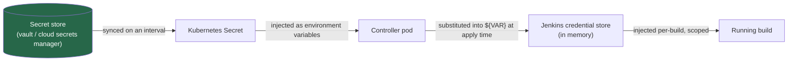

# 15 — Jenkins as immutable infrastructure

The rest of these docs describe a platform: nodes, storage, the edge. This
chapter is about something that runs *on* a platform like that but follows a
different discipline — a Jenkins controller whose entire state, bar build
history, is derived from a Git repository. Destroy the controller and it comes
back, in about fifteen minutes, with the same jobs, the same security
configuration and the same plugin versions it had before. Nothing about it is
configured by clicking.

That property — rebuildable from source, not from a snapshot — is the same
instinct behind the rest of these docs, applied to a CI/CD server instead of a
Kubernetes cluster. It is included here because a platform is only as
reproducible as the weakest hand-configured thing running on top of it, and a
clicked-through Jenkins controller is usually that thing.

## 15.1 The idea

A Jenkins controller configured through its web UI keeps its state in one
place: the `jenkins_home` directory on its volume. There is no review of a
change made that way, no record of who made it, and no way to produce a second
controller that is actually identical to the first. Disaster recovery for a
controller like that is "restore a volume snapshot and hope it was recent
enough."

The alternative treated in this chapter inverts that: **Git is the source of
truth**, and the controller is a disposable projection of it.

- Every setting the controller boots with — its security realm, its agent
  clouds, its credentials, its tool configuration — is a YAML file in the
  repository, applied automatically at startup.
- Every job on the controller is generated from a definition file in the same
  repository. None is created by hand.
- A controller can be deleted entirely and rebuilt from an empty cluster with
  one command. What comes back is byte-for-byte the same configuration; what
  is lost is build history, not build capability.

That last point is worth sitting with, because it changes how you're willing
to treat the controller. A hand-configured Jenkins is the one server nobody
dares touch, because nobody is quite sure what rebuilding it would take. A
controller built this way is closer to a cache: valuable while it's running,
recoverable in minutes if it isn't.

The trade is real and worth naming up front, because §15.6 comes back to it in
detail: you give up the ability to fix something by clicking. What you get is
that nobody can quietly *break* something by clicking either, and that "who
changed this, and why" always has an answer — `git log`.

## 15.2 Three layers, one direction of flow

The single idea worth internalising before anything else is that **three
different mechanisms configure three different things**, and they apply in a
strict order. Mixing up which layer owns which setting is the most common
source of confusion when people first meet a controller built this way.

| Layer | Configures | Applied by |
|---|---|---|
| **Helm** | The Kubernetes objects around the controller: its StatefulSet, Service, Ingress, persistent volume, RBAC, and which plugins get baked into the image | `helm upgrade` |
| **Configuration as Code (JCasC)** | The controller's *settings* once it's running: security realm and authorisation, agent clouds, credentials, tool integrations | Rendered into a ConfigMap by the Helm chart; applied at boot, and again on reload |
| **Job definitions** | The jobs themselves | Generated by exactly one job — the seed job — which JCasC is responsible for creating |

The chain of custody runs one way, and only one way:



Helm creates the controller and hands JCasC to it as configuration. JCasC
configures the controller and creates precisely one job. That one job — and
no other mechanism — is trusted to create everything else.

Why this matters in practice: **a change to a job never needs a Helm
release.** Jobs are the thing that changes daily — a new pipeline, an extra
stage, a tweaked schedule — and the path from "merge a pull request" to "the
job exists on the controller" runs entirely through the seed job's own poll or
webhook trigger. A change to the controller's *settings* — a new credential, a
different agent image, an authorisation change — goes through JCasC and takes
effect on the next reload, usually within seconds, with no pod restart. Only a
change to the Kubernetes objects themselves — a new plugin, a resource limit,
an image tag — needs a Helm release, and that is deliberately the slowest and
most visible of the three paths, because it's also the one most likely to
replace the running pod.

Reversing the direction — letting a job reach back and modify JCasC, or
letting JCasC define jobs directly instead of delegating to the seed job —
would collapse this into one undifferentiated blob of configuration, and with
it the ability to reason about which change requires which kind of care. The
one-way flow is the whole point.

### The generated-state trap

Because jobs are generated, editing one directly in the UI works — right up
until the seed job next runs, at which point the edit is silently reverted to
whatever the definition file says. This is surprising exactly once per person,
and it's a feature rather than a bug: it's what keeps a generated job
identical to its definition indefinitely, instead of drifting from it the way
a hand-copied job inevitably does. The practical consequence is that write
access to the job definitions matters more than write access to the jobs
themselves, and RBAC (§15.4) is set up accordingly.

## 15.3 Ephemeral Kubernetes agents

The controller itself runs no builds. Its executor count is set to zero, and
that single setting is arguably the highest-value line in the whole
configuration: a build sharing the controller's JVM can read every credential
the controller holds, its encryption keys, and its own Kubernetes identity. A
careless — never mind malicious — build script would compromise the entire
estate. With no executors on the controller, a build can only run somewhere
else: on a freshly created pod, in a separate namespace, with its own narrow
identity, that exists for the duration of one build and is deleted the moment
it finishes.

### What happens when a build starts



A "cloud" in this model is just a source of agents — a Kubernetes endpoint the
controller is allowed to create pods against. A "pod template" is a recipe for
one kind of agent: an image, a resource request, a node placement rule,
selected by a label a pipeline asks for. One controller can hold several
clouds, and this is where the design becomes more than a single-cluster
convenience: a cloud can point at the *same* cluster the controller runs in,
or at the API endpoint of an entirely different one.

### Agents in other clusters

A build that needs to deploy into a production cluster the controller doesn't
otherwise touch is handled the same way, with one twist: the agent pod for
that build is created *inside the target cluster*, using a narrowly scoped
identity that belongs to that cluster, not the controller's own identity. The
deploy step then runs against the target cluster's own local API server. The
credential capable of deploying to a given environment lives in that
environment — it never travels to the controller, and the controller never
holds it.

Two things make this practical rather than merely theoretical:

- **The remote agent connects outbound over the same channel that serves the
  UI**, rather than requiring an inbound port to be opened on the remote
  cluster for the controller to reach in. For a cluster sitting behind a
  private network boundary, this is frequently the difference between the
  design being approved by a network team and not.
- **The identity used in the remote cluster is scoped to one namespace and a
  handful of pod verbs** — create, delete, watch a pod and read its logs —
  never to that cluster's secrets, nodes or other workloads. The controller
  can start a pod in a named namespace of a remote cluster. It cannot read
  anything else there.

### Why ephemeral beats long-lived

| Property | Long-lived agents | Ephemeral, one-pod-per-build |
|---|---|---|
| State between builds | Can leak — a stray file makes build #2 pass only because build #1 left something behind | Cannot leak — the filesystem didn't exist five seconds ago |
| Fleet to patch | A set of VMs that drift from each other over time | None — there is no fleet |
| "Which Java is on the agent?" | Tribal knowledge, or a login away | An image tag in a reviewed configuration file |
| Idle capacity | Agents sit idle between releases | Nothing is running when nothing is queued |
| Cost of the model | Low startup latency | 10–40 seconds of pod scheduling and image pull per build |

That last row is the one genuine cost, and it's why the cloud definitions set
generous connection timeouts rather than fighting the latency — a build
waiting 20 seconds for a pod to exist is a non-event; a build failing because
the timeout was tuned for a warm fleet is a nuisance somebody has to debug
every week.

### One controller, several clusters — the argument both ways

An equally defensible alternative design is one controller per cluster, or per
team. This design chooses one controller reaching into several clusters
instead, and it's worth stating the trade honestly rather than only defending
the choice made.

The case *for* one controller: jobs, credentials, RBAC, plugin versions and
the audit trail all live in one place. Running several controllers means
running several independent upgrade cycles and several copies of an access
model — and copies drift. The case *against* is blast radius: a single
controller with reach into several clusters is a more valuable target than
any one of them alone. The answer this design gives is scoping, not denial —
every remote cloud uses a namespace-scoped identity that can create pods and
nothing else, and the credential that can actually change something in a
target environment stays in that environment. Whether that answer is
sufficient for a given organisation's risk appetite is a judgement call, not a
fact, and a controller-per-cluster design is a legitimate answer to the same
question with a different blast-radius trade.

## 15.4 Security

Three mechanisms carry the security weight here: who a person is, what they're
allowed to do, and how a build gets hold of a secret without that secret ever
appearing in a repository.

### Authentication and authorisation

Identity is federated to an external identity provider over OIDC rather than
maintained as local Jenkins accounts — group membership from the identity
provider becomes the basis for what a signed-in user can do. Authorisation on
top of that is role-based: a small number of roles (an administrator role, a
developer role, a read-only role) map onto specific permission sets, and the
important discipline is what is deliberately *withheld* — the ability to
change global security settings, or to hand-edit a generated job, is not
something most signed-in users hold, precisely because both of those are the
kind of change that either locks everyone out or silently reverts on the next
seed-job run.

This is also the one part of the configuration that deserves genuine caution.
Get the security realm or the authorisation strategy wrong and the failure
mode is total: nobody, including the person who made the change, can sign in
to fix it through the UI — because the UI is what's broken. The recovery path
does not depend on the UI, which is the entire reason this matters: the
change lives in Git, so the fix is `git revert` followed by a redeploy. A
break-glass path — starting the controller with its configuration-as-code
step temporarily disabled, so it boots on whatever is already on disk instead
of the broken file — exists for the case where even the revert can't be
applied fast enough, and it is treated as exactly that: an emergency action
taken with a witness, not a debugging convenience reached for casually.

### Credentials that are never committed

Every credential the controller uses is a placeholder — a reference to an
environment variable — rather than a literal value, resolved only at the
moment the controller applies its configuration:

```yaml
username: "${SCM_USERNAME}"
password: "${SCM_APP_PASSWORD}"
```

That single convention is what keeps a secret out of the repository
altogether, and the chain behind it looks like this:



What this buys, concretely: a leaked copy of the configuration repository
leaks nothing, because there is nothing in it to leak. Rotating a credential
is a change made in the secret store, not a commit, a pull request or a
redeploy — update the store, let the sync catch up, and the next reload picks
up the new value. And because an *unset* variable is not an error — the
placeholder is simply left in the configuration as a literal string — a
credential that "looks fine but doesn't work" is diagnosed by checking for a
stray `${...}` in the exported configuration before looking anywhere else.

The same scoping discipline shows up twice more: a build's credential for
reading source is deliberately not the same credential used for the rare job
that needs to push a tag, and where the underlying platform supports it
(workload identity federation between a pod and a cloud IAM role, for
instance) a build gets a short-lived, auto-rotated identity instead of a
credential at all. Nothing about this eliminates the need for care in
pipeline scripts — masking a secret in build output only catches an exact
string match, so encoding it, echoing it, or tracing a shell script that
touches it all defeat the mask — but it removes the single largest source of
long-lived Jenkins credential leaks, which is a plaintext value sitting in a
values file that nobody reviewed closely enough.

## 15.5 Operations

### Upgrades and plugin pinning

Almost everything Jenkins does is a plugin, plugins update on independent
schedules, and a bad combination of versions is where most real Jenkins
outages come from — not load, not the jobs themselves. The response is to pin
every plugin to an exact version and disable the chart-level default that
resolves *unpinned* dependency versions at image-build time, because that
default silently discards a pin the moment a plugin depends on something you
didn't name explicitly. Two deploys of the same commit should produce the
same controller; without deliberate pinning, they don't.

Practical rules that keep upgrades boring:

- Upgrade core and plugins **separately**. When both move in the same change
  and the controller won't start, there is no way to tell which one broke it.
- A plugin installation or upgrade always requires a restart — plugins load
  at JVM boot, and a configuration reload will not pick up a new one.
- After any plugin upgrade, confirm three things before calling it done: the
  controller started with no load failures in its log, the configuration
  applied without a schema error, and — the one people forget — **the seed
  job still runs successfully.** A Job DSL plugin upgrade can quietly remove a
  method a job definition relies on, and a job that generated cleanly
  yesterday can fail to generate today for reasons that have nothing to do
  with the job itself.
- Plugin downgrades are not reliably safe — some plugins migrate their stored
  configuration on first start with a new version, and that migration doesn't
  run in reverse. A volume snapshot taken immediately before a plugin upgrade
  batch is the only dependable undo.

### Disaster recovery

The property that makes this design worth the setup cost is that a total loss
of the controller costs you build *history*, not build *capability*. Rebuild
sequence on an empty cluster:

1. Put the credential material the controller needs at boot in place first —
   it resolves those values as it applies its configuration.
2. Deploy the Helm release. The controller boots, applies its configuration,
   and comes up with its security realm, clouds and credentials already in
   place.
3. The seed job runs on its normal trigger — or is triggered manually — and
   regenerates every other job.

That whole sequence takes roughly ten to fifteen minutes to a working
controller, and the only thing missing at the end of it is build history —
restored separately, from a volume snapshot, if it matters for that
particular recovery. A disaster-recovery plan that has never actually been
run is a hypothesis rather than a plan; standing up a throwaway controller
from the repository periodically is what turns it into a rehearsed fact.

### What breaks, and how you tell

| Symptom | Usual cause | Where to look first |
|---|---|---|
| Controller won't start | A plugin needs a newer core version than the pinned one, or two plugins conflict | The controller's own startup log, filtered for load failures |
| Configuration silently not applying | A YAML syntax error, or a value referencing a plugin class that isn't installed | The configuration-reload sidecar's log, then the configuration page in the UI |
| A credential "looks right" but every build using it fails auth | The environment variable it resolves from was never set | Check for a literal, unsubstituted placeholder in the exported configuration |
| Jobs have vanished | A job definition file was renamed or deleted, and job removal is configured to actually delete | The seed job's last console output |
| Builds queue but nothing starts | Agent pods stuck in a pending state, or the concurrent-build ceiling has been reached | Describe the pending pod — it names the scheduling reason |
| The estate has quietly stopped tracking source | The seed job has been failing silently for some time | Whether the seed job's own status is being alerted on at all |

That last row deserves the emphasis operations docs tend to give it: a
generation job that fails silently is the single most damaging failure mode
here, precisely because nothing *looks* wrong. The controller runs, builds
run, and the only symptom is that somebody's merged change never actually
took effect — which is usually noticed much later than it should be. Alerting
on the seed job's own status, not just on individual build failures, closes
that gap.

## 15.6 Trade-offs

None of this is free, and it's worth being precise about what it costs rather
than presenting it as a strictly dominant strategy.

**Iteration is slower than clicking.** Changing a setting through the UI takes
effect the moment you click. Changing it as code means a commit, a review,
and — for anything that isn't picked up by a live reload — a deploy. During
an incident, that extra step is friction you feel directly, and it's the one
occasion where a hand-configured controller genuinely has the edge.

**Plugin-version coupling is real work, not a one-off.** Pinning every plugin
version buys reproducibility, but it also means every upgrade is a decision
someone has to make and test, rather than something that happens for free in
the background. A controller left on its defaults absorbs plugin updates
silently and finds out about incompatibilities in production; a pinned
controller finds out about them in a deliberate upgrade window instead — the
same problems still exist, just moved earlier and made visible.

**The seed job is a bootstrap problem, and a single point of failure.** It is
the one job in the system that cannot generate itself — changing its own
definition means changing the controller's configuration directly and
redeploying, not merging a job-definition change. And because every other job
depends on it running successfully, it needs the same operational care as the
security configuration: a failure there doesn't just break one pipeline, it
breaks the mechanism that keeps every pipeline in sync with source.

**Why it's still worth it.** The costs above are all *procedural* — they slow
a change down or add a review step. The alternative's costs are
*structural* — no record of who changed what, no way to reproduce a
controller, and a recovery plan that depends on a snapshot being both recent
and intact. Procedural friction is the kind of cost you can budget for.
Structural risk is the kind you discover during an outage, at the worst
possible time to be learning it. A team that finds the extra review step
genuinely too slow for a specific, well-understood change has a narrower fix
available — tightening what needs a full deploy versus what a live reload
already covers — long before "give up and configure it by hand again" is the
right answer.
