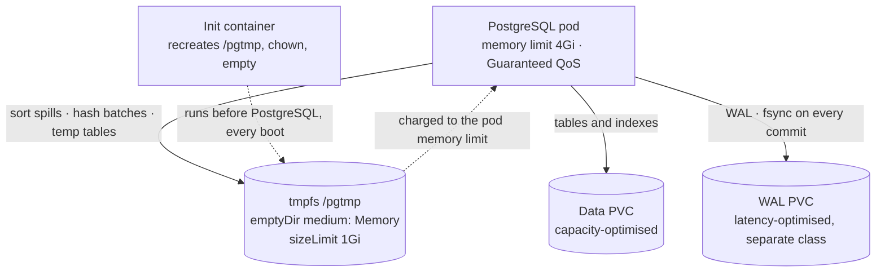

# 16 — Hybrid PostgreSQL: RAM-backed scratch storage

A PostgreSQL deployment that keeps **durable data on disk** and moves **scratch
storage into RAM**, with `fsync` and `synchronous_commit` left on throughout.
Measured against production workloads, it improved query performance by
**40–70%** — without trading away a single durability guarantee.

This page is about how it is built and what makes it safe to run, because the
mechanism itself is two lines. Everything that matters is in the operational
detail around them.

---

## 16.1 What actually changes

PostgreSQL has no in-memory storage engine, and "in-memory PostgreSQL" is a
misleading name for what this is. It is a **hybrid**: tables, indexes and WAL
stay exactly where they were, and only *scratch* storage moves.

| | Ordinary PostgreSQL | This deployment |
|---|---|---|
| Table data | Disk | **Disk — unchanged** |
| WAL | Disk, usually the same volume | **Disk, its own latency-optimised volume** |
| Sort and hash spills | Disk | **tmpfs (RAM)** |
| Temp tables | Disk | **tmpfs (RAM)** |
| Index build scratch | Disk | **tmpfs (RAM)** |
| `shared_buffers` | RAM | RAM — unchanged |
| `fsync` / `synchronous_commit` | on | **on — unchanged** |
| Crash recovery | WAL replay | WAL replay — unchanged |

Four rows change. Everything governing durability and correctness stays put —
which is what makes the change reversible and safe to argue for.

The mechanism:

```sql
CREATE TABLESPACE temp_mem_ts LOCATION '/pgtmp';   -- /pgtmp is a tmpfs mount
-- postgresql.conf:
-- temp_tablespaces = 'temp_mem_ts'
```

## 16.2 Why it pays

A sort or hash that exceeds `work_mem` does not fail — it **spills**, writing
intermediate results out and reading them back. That I/O is purely mechanical:
the data is already computed, it is being parked somewhere because there is
nowhere else to put it. Move the parking space to RAM and the I/O disappears.

The reason spilling is so common in production is that **`work_mem` is
per-operation, not per-connection**. A query with three joins and a sort can use
four times `work_mem`; at 100 connections that authorises a hundred times more
memory than anyone intends. So production `work_mem` is kept in the tens of
megabytes, and spills are routine by design.

That is the honest framing of this work: **it makes a conservative `work_mem`
cheaper**, rather than making everything faster. The workloads that gain are the
ones that spill — analytical queries over data larger than RAM, ETL staging
through temp tables, index builds, and any node running many concurrent
sort-heavy queries where raising `work_mem` globally would be reckless.

## 16.3 The production shape

Three storage tiers, each provisioned for what it actually does:



**Splitting WAL onto its own volume is a separate win worth taking on its own.**
WAL writes are small, sequential and `fsync`'d on every commit; data writes are
larger and more random. Sharing one volume means commit latency competes with
checkpoint flushes and query I/O. Split them and commit latency depends only on
the WAL device, which can be provisioned for latency while the data volume is
provisioned for capacity. On a write-heavy workload that often matters more than
the tmpfs does.

## 16.4 Three things that make it safe

**1. The init container is not optional.** tmpfs comes back **empty** after every
restart, and PostgreSQL will not create a tablespace directory itself. If the
directory is missing while the catalog still references the tablespace, the
server can fail to start — with an error that gives no hint the cause is a
volume that is empty by design. Someone debugging at 3am sees "PostgreSQL won't
start" and has no reason to connect it to a tablespace that was fine yesterday.
So an init container recreates the directory on every boot, with the right
ownership and permissions, and ensures it is empty (PostgreSQL refuses a
tablespace directory that is not).

**2. `sizeLimit` is mandatory, and it is a failure-design decision.** Without it,
tmpfs can grow to half the node's RAM, and one runaway query can destabilise
every pod on that node. With it, that query fails with `No space left on device`
and nothing else is touched. **Choose the query error over the node-wide
incident** — that is the entire argument.

**3. tmpfs is charged to the pod's memory cgroup**, which is the most common way
this pattern goes wrong. A 4 Gi pod with a 1 Gi tmpfs gives PostgreSQL 3 Gi, not
4. Fill the tmpfs while PostgreSQL is near its limit and the **pod** is
OOM-killed — every connection dropped, every in-flight transaction lost, on a
database that was healthy a second earlier. The budget has to be written down:

```
shared_buffers + (work_mem × expected concurrent ops) + tmpfs + ~1Gi overhead
    ≤ pod memory limit
```

Memory requests are set equal to limits, so the database gets Guaranteed QoS and
is not the first thing evicted under node pressure.

## 16.5 The trap that silently disables the whole thing

This is the most valuable thing learned building it, because the failure is
**invisible**. The obvious way to make tablespace creation idempotent looks like
this — and never works:

```sql
DO $$ BEGIN
    CREATE TABLESPACE temp_mem_ts LOCATION '/pgtmp';
EXCEPTION WHEN duplicate_object THEN NULL;
END $$;
```

A `DO` block is an implicit transaction, and `CREATE TABLESPACE` **cannot run
inside a transaction block**. So it fails *every* time with `cannot run inside a
transaction block` — and the exception handler swallows the error. The
tablespace is never created. `temp_tablespaces` then points at something that
does not exist, PostgreSQL quietly falls back to the default tablespace, and
**everything appears to work perfectly while the RAM tablespace does nothing at
all.** You would see no error, no warning, and no speed-up — and reasonably
conclude the technique doesn't work.

The fix is `\gexec`, which runs the generated statement as a top-level command
outside any transaction:

```sql
SELECT format('CREATE TABLESPACE temp_mem_ts LOCATION %L', '/pgtmp')
WHERE NOT EXISTS (SELECT 1 FROM pg_tablespace WHERE spcname = 'temp_mem_ts')
\gexec
```

**The general lesson** generalises well beyond PostgreSQL: an exception handler
that swallows a class of error will eventually swallow one you needed to see. A
bootstrap step that cannot fail loudly will fail silently instead, and silent
failure in a performance feature looks exactly like the feature not being worth
much.

## 16.6 Verifying it is real

Two checks, because **SQL alone cannot tell you the storage medium** — a
tablespace registered at `/pgtmp` looks identical whether that path is RAM or
a spinning disk:

```bash
kubectl exec sts/postgres -c postgres -- df -hT /pgtmp    # expect: tmpfs
```

Then confirm the workload actually uses it. The deployment ships views for this,
so sizing is driven by evidence rather than guesswork:

| View | Question it answers |
|---|---|
| `perf.spill_summary` | Is this database spilling at all? If `temp_bytes` is near zero, a RAM tablespace can do nothing for you |
| `perf.top_spilling_queries` | Which queries are responsible, and how much each spills per call |
| `perf.cache_health` | Is memory better spent on cache than on tmpfs? Below ~95% hit ratio, raise `shared_buffers` first |
| `perf.tablespace_layout` | Which tablespaces exist and where they point |

Size the tmpfs from the largest spill actually observed, times the number that
may run concurrently, plus headroom — then check the total still fits the memory
budget in §16.4.

## 16.7 Supporting configuration

Two settings in the tuned config are worth calling out because they are
independent of this design and fix more than it does:

- **`random_page_cost = 1.1`.** The default of `4.0` is calibrated for spinning
  disks, where seeking was genuinely expensive. On SSD or NVMe it systematically
  discourages index scans in favour of sequential scans. This single line fixes
  more slow queries than anything else in the file.
- **Parallelism sized from the container's CPU *limit*, not the node's core
  count.** PostgreSQL cannot see the cgroup quota and will happily start more
  workers than it is allowed, producing throttling rather than speed. Each
  parallel worker also gets its own `work_mem`, so a gather with four workers
  uses five times `work_mem` for that node.

Autovacuum stays **on**. Disabling it is a tempting quick win on a write-heavy
system and a reliable way to produce bloat, stale statistics and an eventual
wraparound emergency at the worst possible moment.

## 16.8 When it does nothing — and how to tell in advance

The technique is not universal, and the condition it depends on is specific:
**it only pays when the kernel page cache cannot already absorb the spills.**

PostgreSQL never `fsync`s temp files — they are written, read back moments
later, and deleted. On a host with plenty of free memory and a fast local
device, the page cache absorbs that entire lifecycle and the spill never reaches
the physical disk. Disk-backed temp space is *already* effectively RAM-backed
there, so adding an explicit RAM filesystem underneath it buys little. A
controlled comparison on a laptop-class host with ~10 GB free and local NVMe
measured almost exactly that: no meaningful difference, with a negative control
confirming the method held.

Production is the opposite environment, which is why the gain is large there:

| Condition | Why the page cache stops absorbing spills |
|---|---|
| **Container memory limits** | A cgroup's page cache is capped by the pod limit, forcing writeback and eviction |
| **Spill larger than free RAM** | Cached pages are evicted and re-read from storage |
| **Network or replicated storage** | Writeback costs one to two orders of magnitude more than local NVMe |
| **Memory pressure from neighbours** | Noisy tenants reclaim cache continuously |
| **Many concurrent spilling queries** | Aggregate spill exceeds the cache, and they compete for it |

A production Kubernetes node typically satisfies several of these at once. That
is the environment this design targets, and it is materially different from a
developer laptop — which is also why laptop benchmarks *understate* the
advantage: on Docker Desktop, "disk" is a virtual disk inside a VM with the
host's cache in front of it. Measure on the hardware you will deploy on.

**Before adopting it**, all of these should hold: spilling is substantial and
ongoing; raising `work_mem` is unsafe because of concurrency; missing indexes
and stale statistics have been ruled out; the node has genuinely spare memory
and a healthy cache hit ratio; `sizeLimit` is set and the memory sum fits.

**A missing index costs an order of magnitude; faster scratch storage buys a
factor.** Fix the index first — always.

## 16.9 Rollback

Point `temp_tablespaces` back at a disk-backed tablespace, or unset it, and
restart. Performance returns to ordinary PostgreSQL and **no data is affected,
because nothing durable was ever on tmpfs**.

That reversibility is the entire argument for moving only scratch space. Placing
a real table on a RAM tablespace is a different proposition: the files vanish on
restart while the catalog still believes in the relation, which produces missing
file errors, autovacuum looping against a relation it cannot read, or a server
that will not start. The moment real tables live on tmpfs, rollback stops being
free — so this deployment moves scratch, and only scratch.
