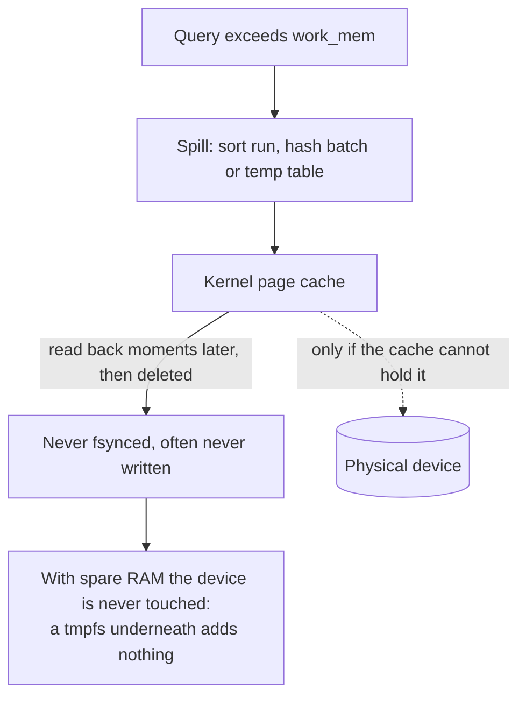

# 16 — Hybrid PostgreSQL: RAM-backed scratch space, and when it helps

PostgreSQL has no in-memory storage engine. What people mean by "in-memory
PostgreSQL" is a **hybrid**: tables and the write-ahead log stay on disk with
`fsync` on, while sort spills, hash batches and temporary tables are placed on a
RAM-backed filesystem.

The whole mechanism is two lines:

```sql
CREATE TABLESPACE temp_mem_ts LOCATION '/pgtmp';   -- /pgtmp is a tmpfs mount
SET temp_tablespaces = 'temp_mem_ts';
```

Everything below is about whether that is worth doing — and the measured answer
is more interesting than the technique.

---

## 16.1 What actually moves

A query that exceeds `work_mem` does not fail; it spills to disk. Three things
land in temporary space:

| Spill | Caused by |
|---|---|
| External merge sort | `ORDER BY` over more rows than `work_mem` holds |
| Hash batches | A hash join whose build side does not fit |
| Temporary tables | Explicit `CREATE TEMP TABLE`, and some `CTE` materialisation |

Durable data — heap, indexes, WAL — is untouched by this change. That is the
point: `fsync` and `synchronous_commit` stay **on**, so no durability is traded
away. Only the scratch space that PostgreSQL was going to delete anyway moves.

## 16.2 The measurement

The honest way to evaluate this is two identical instances differing in exactly
one configuration line, with a workload built to force spilling — `work_mem`
deliberately small, a dataset several times larger than `shared_buffers` — and a
negative control that should show no difference at all.

Measured on a developer machine with spare memory and a local NVMe SSD:

| Workload | Disk temp | RAM temp | Speed-up |
|---|---:|---:|---:|
| External merge sort | 1952 ms | 1921 ms | 1.02× |
| Hash join (spilling) | 192 ms | 199 ms | 0.96× |
| Temp table materialise | 259 ms | 254 ms | 1.02× |
| Index build | 2903 ms | 2714 ms | 1.07× |
| `DISTINCT` aggregate | 1243 ms | 1123 ms | 1.11× |
| *Cached lookup (control)* | *595 ms* | *593 ms* | *1.00×* |

**Essentially no improvement — and that is the finding.**

The workloads genuinely spilled: roughly 2 GB of temporary files, confirmed by
PostgreSQL's own counters. The tmpfs was genuinely in use. The control landed at
exactly 1.00×, so the method held. The mechanism worked and bought nothing.

## 16.3 Why it bought nothing

After writing about 2 GB of temporary files, the disk-backed instance reported
roughly **148 kB dirty and zero bytes in writeback**. Those writes never reached
the physical device.

**PostgreSQL never `fsync`s temporary files.** They are written, read back
moments later, and deleted. Given free memory, the kernel page cache absorbs
that entire lifecycle. On a host with spare RAM and a local SSD, disk-backed
temporary space *is already RAM-backed* — so putting an explicit RAM filesystem
underneath it adds a second copy of something the kernel was doing for free.



## 16.4 When it does help

Exactly when the page cache cannot do that job:

- **Container memory limits.** A cgroup's page cache is capped, which forces
  writeback and eviction that would not happen on an unconstrained host.
- **Spills larger than free memory.** Cached pages get evicted and re-read.
- **Network-attached storage** — EBS, NFS, Ceph RBD — where writeback costs one
  to two orders of magnitude more than local NVMe.
- **Memory pressure from neighbours.** Cache reclaimed continuously by other
  workloads on the same node.
- **Many concurrent spilling queries**, whose aggregate spill exceeds the cache.

A Kubernetes node usually has *several* of these at once: memory-limited pods,
network-attached volumes, multiple tenants. That is a materially different
environment from a laptop with 10 GB free and local NVMe — which is precisely
why the benchmark above **cannot** reproduce it, and why no production number is
claimed from it.

## 16.5 How this connects to the storage decision

This is the same argument as [03 — Storage decision](03-storage-decision.md),
one layer up the stack. There, the question was whether a write crosses the
network before it is acknowledged. Here, it is whether a spill crosses anything
at all.

On **Cluster B** (node-local TopoLVM) the page cache and a local NVMe device
already make temporary space fast, so a RAM tablespace has little left to win —
the measurement above is the relevant case. On **Cluster A**, or anywhere
temporary space lands on replicated or network-attached storage, every spilled
byte crosses the storage network, and moving scratch space to RAM removes that
traffic entirely. Same technique, opposite verdict, decided by what sits beneath
the mount point.

## 16.6 If you deploy it

- **Size the tmpfs deliberately and account for it.** It is memory. A tmpfs that
  grows without limit competes with `shared_buffers` and with the page cache you
  were relying on; in a container it counts against the memory limit and can get
  the pod OOM-killed rather than merely slowed.
- **Cap the spill**, with `temp_file_limit`, so one pathological query cannot
  consume the whole tablespace.
- **The tablespace is volatile.** A tmpfs is empty after a restart, so the
  directory must be recreated with the right ownership before PostgreSQL starts
  or it will refuse to open the tablespace. On Kubernetes that is an init
  container or a `subPath` on an `emptyDir` with `medium: Memory`.
- **Never put anything durable there.** A tablespace on tmpfs holding a real
  table is data loss on the next reboot, and PostgreSQL will not stop you.
- **Measure on your own hardware before and after.** The honest summary of this
  whole page is that the answer depends entirely on what is underneath, and the
  only way to know is to run the comparison where it will actually live.

## 16.7 The general lesson

A technique that is obviously faster in principle can be worth nothing in
practice, because a layer underneath is already solving the problem. The useful
output of the exercise was not a speed-up; it was knowing the precise conditions
under which the speed-up appears — container limits, network storage, memory
pressure — and being able to say so with a measurement rather than an intuition.
